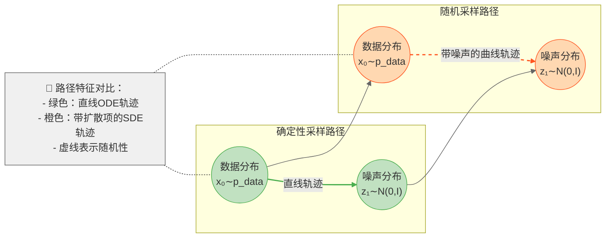

# Diffusion 遇见 Flow Matching：殊途同归的生成模型

## 引言

> **🔑 核心结论**  
> - Diffusion 与 Flow Matching 在**高斯源分布**和**线性路径**下等价  
> - 两者差异源于**模型参数化方式**，而非本质区别  
> - 实践者可自由混合使用两者的训练和采样技术  

Flow Matching 和 Diffusion Models 是生成模型领域的两个重要框架。尽管它们看起来很相似，但社区中对它们之间的具体联系仍存在一些困惑。本文旨在厘清这种困惑，并展示一个重要发现：**Diffusion Models 和 Gaussian Flow Matching 本质上是等价的**，只是不同的模型设定会导致不同的网络输出和采样方案。这个发现意味着我们可以交替使用这两个框架。

近期，Flow Matching 因其简单的理论基础和 "直线" 采样轨迹而受到广泛关注。这引发了一个常见问题：

> "究竟是 Diffusion 更好，还是 Flow Matching 更好？"

正如我们将要展示的，对于常见的特殊情况（即 Flow Matching 中使用高斯分布作为源分布时），Diffusion Models 和 Flow Matching 是 **等价的**，所以这个问题并没有唯一答案。具体来说，我们将展示如何在这两种方法之间进行转换。

这种等价性为什么重要？因为它允许我们混合使用这两个框架中开发的技术。例如，在训练 Flow Matching 模型后，我们可以使用随机或确定性的采样方法（这与人们普遍认为 Flow Matching 总是确定性的观点相反）。

本文将重点关注最常用的 Flow Matching 形式，即基于最优传输路径的方法，它与 Rectified Flow 和 Stochastic Interpolants 密切相关。我们的目的不是推荐使用其中某一种方法（两种框架都很有价值，它们源于不同的理论视角，而且它们在实践中能得到相同的算法更令人鼓舞），而是帮助实践者理解并自信地交替使用这些框架。

## 1. 概述

让我们先快速回顾这两个框架的基本原理。

### 1.1 Diffusion Models 基础

Diffusion 过程通过向观测数据点 $\mathbf{x}$ 逐步添加高斯噪声来构建扩散过程。在时间 $t$ 时的带噪声数据由前向过程给出：

$$\mathbf{z}_t = \alpha_t \mathbf{x} + \sigma_t \boldsymbol{\epsilon}, \quad \text{其中} \quad \boldsymbol{\epsilon} \sim \mathcal{N}(0, \mathbf{I}) \tag{1}$$

这里 $\alpha_t$ 和 $\sigma_t$ 定义了**噪声调度**（Noice Schedule）。如果满足 $\alpha_t^2 + \sigma_t^2 = 1$，则称该噪声调度为方差保持的。噪声调度的设计使得 $\mathbf{z}_0$ 接近原始数据，而 $\mathbf{z}_1$ 接近标准高斯分布。

### 1.2 Flow Matching 基础

在 Flow Matching 中，我们将前向过程视为数据 $\mathbf{x}$ 和噪声项 $\boldsymbol{\epsilon}$ 之间的线性插值：

$$\mathbf{z}_t = (1-t)\mathbf{x} + t\boldsymbol{\epsilon} \tag{2}$$

需要注意的是，这种线性插值设定并不保证方差保持（即 $\alpha_t^2 + \sigma_t^2 = 1$）。例如，当 $t=0.5$ 时，$(1-t)^2 + t^2 = 0.5 \neq 1$。这种等价性仅在特定调度（如 $\alpha_t = \sqrt{1-t^2}, \sigma_t = t$）下成立，但实际应用中可通过调整模型预测目标来兼容不同调度。

对于任意时间点 $s < t$，我们可以通过以下步骤推导出它们之间的关系：

$$\begin{aligned}
\mathbf{z}_t &= (1-t)\mathbf{x} + t\boldsymbol{\epsilon} \\
\mathbf{z}_s &= (1-s)\mathbf{x} + s\boldsymbol{\epsilon} \\
\mathbf{z}_t - \mathbf{z}_s &= [(1-t)\mathbf{x} + t\boldsymbol{\epsilon}] - [(1-s)\mathbf{x} + s\boldsymbol{\epsilon}] \\
&= (-t+s)\mathbf{x} + (t-s)\boldsymbol{\epsilon} \\
&= (t-s)(\boldsymbol{\epsilon} - \mathbf{x}) \\
&= \mathbf{u} \cdot (t - s)
\end{aligned} \tag{3}$$

其中 $\mathbf{u} = \boldsymbol{\epsilon} - \mathbf{x}$ 是"速度"或"向量场"。

## 2. 采样过程的等价性

人们普遍认为这两个框架在生成样本时有所不同：Flow Matching 采样是确定性的，具有"直线"路径，而 Diffusion Model 采样是随机的，具有"曲线"路径。下面我们来澄清这个误解。

### 2.1 DDIM 与 Flow Matching 采样器的等价性

回顾 DDIM 的更新公式：

$$\mathbf{z}_s = \alpha_s \hat{\mathbf{x}} + \sigma_s \hat{\boldsymbol{\epsilon}} \tag{4}$$

我们可以通过以下步骤将其重写为增量形式：

$$\begin{aligned}
\mathbf{z}_s &= \alpha_s \hat{\mathbf{x}} + \sigma_s \hat{\boldsymbol{\epsilon}} \\
\mathbf{z}_t &= \alpha_t \hat{\mathbf{x}} + \sigma_t \hat{\boldsymbol{\epsilon}} \\
\mathbf{z}_s - \mathbf{z}_t &= (\alpha_s - \alpha_t)\hat{\mathbf{x}} + (\sigma_s - \sigma_t)\hat{\boldsymbol{\epsilon}} \\
&= (\alpha_s - \alpha_t)(\hat{\mathbf{x}} - \hat{\boldsymbol{\epsilon}}) \\
&= \hat{\mathbf{v}} \cdot (\eta_s - \eta_t)
\end{aligned} \tag{5}$$


其中 $\hat{\mathbf{v}} = \hat{\mathbf{x}} - \hat{\boldsymbol{\epsilon}}$ 是模型预测的向量场，$\eta_t = \alpha_t - \sigma_t$。

### 2.2 训练目标的等价性

让我们来看看这两个框架的训练目标是如何联系的。

### DDPM 的训练目标

在 DDPM 中，我们通常最小化预测噪声的 MSE 损失：

$$\mathcal{L}_{\text{DDPM}} = \mathbb{E}_{t,\mathbf{x},\boldsymbol{\epsilon}}\left[\|\boldsymbol{\epsilon} - \hat{\boldsymbol{\epsilon}}_\theta(\mathbf{z}_t, t)\|^2\right] \tag{6}$$

其中 $\hat{\boldsymbol{\epsilon}}_\theta$ 是神经网络预测的噪声。

### Flow Matching 的训练目标

Flow Matching 的目标是学习一个向量场（Velocity Field），其损失函数为：

$$\mathcal{L}_{\text{FM}} = \mathbb{E}_{t,\mathbf{x},\boldsymbol{\epsilon}}\left[\|\mathbf{u} - \hat{\mathbf{v}}_\theta(\mathbf{z}_t, t)\|^2\right] \tag{7}$$

其中 $\mathbf{u} = \boldsymbol{\epsilon} - \mathbf{x}$ 是真实向量场，$\hat{\mathbf{v}}_\theta$ 是神经网络预测的向量场。

### 两者的等价性

这两个目标函数看起来很不一样，但实际上它们是等价的。让我们先看看不同的网络输出形式：

#### 网络输出的不同形式

文献中提出了几种不同的网络输出形式，它们可以相互转换。每种形式对应的 MSE 损失也有所不同：

| 网络输出 | 公式 | MSE 损失 |
|---------|------|----------|
| $\hat{\boldsymbol{\epsilon}}$-预测 | $\hat{\boldsymbol{\epsilon}}$ | $\|\hat{\boldsymbol{\epsilon}} - \boldsymbol{\epsilon}\|^2$ |
| $\hat{\mathbf{x}}$-预测 | $\hat{\mathbf{x}} = \frac{\mathbf{z}_t - \sigma_t\hat{\boldsymbol{\epsilon}}}{\alpha_t}$ | $\|\hat{\mathbf{x}} - \mathbf{x}\|^2 = e^{-\lambda}\|\hat{\boldsymbol{\epsilon}} - \boldsymbol{\epsilon}\|^2$ |
| $\hat{\mathbf{v}}$-预测 | $\hat{\mathbf{v}} = \alpha_t\hat{\boldsymbol{\epsilon}} - \sigma_t\hat{\mathbf{x}}$ | $\|\hat{\mathbf{v}} - \mathbf{v}\|^2 = \alpha_t^2(e^{-\lambda} + 1)^2\|\hat{\boldsymbol{\epsilon}} - \boldsymbol{\epsilon}\|^2$ |
| Flow Matching 向量场 | $\hat{\mathbf{v}} = \hat{\boldsymbol{\epsilon}} - \hat{\mathbf{x}}$ | $\|\hat{\mathbf{v}} - \mathbf{v}\|^2 = (e^{-\lambda/2} + 1)^2\|\hat{\boldsymbol{\epsilon}} - \boldsymbol{\epsilon}\|^2$ |

其中 $\lambda = \log(\alpha_t^2/\sigma_t^2)$ 是对数信噪比。这些不同的预测形式为我们提供了更多的实现选择，可以根据具体应用场景选择最合适的形式。

这个表格展示了一个重要的事实：虽然这些预测形式看起来不同，但它们都可以通过简单的变换相互转换，并且它们的 MSE 损失之间存在确定的比例关系。这种等价性使得我们可以灵活地在不同的预测形式之间切换，而不会影响模型的本质性能。

#### 转换关系

基于上述不同形式的理解，我们可以看到这两个框架之间的具体转换关系：

1. 在 DDPM 中，模型预测噪声 $\hat{\boldsymbol{\epsilon}}$，可以用来恢复原始数据 $\hat{\mathbf{x}}$：
   $$\hat{\mathbf{x}} = \frac{\mathbf{z}_t - \sigma_t\hat{\boldsymbol{\epsilon}}}{\alpha_t} \tag{8}$$

2. 在 Flow Matching 中，模型直接预测向量场 $\hat{\mathbf{v}}$，它等价于：
   $$\hat{\mathbf{v}} = \hat{\mathbf{x}} - \hat{\boldsymbol{\epsilon}} \tag{9}$$

3. 当使用线性噪声调度 $\alpha_t = 1-t, \sigma_t = t$ 时，这两个框架的预测可以相互转换：

   $$\begin{aligned}
   \text{DDPM} \rightarrow \text{FM}: \quad \hat{\mathbf{v}} &= \hat{\mathbf{x}} - \hat{\boldsymbol{\epsilon}} \\
   \text{FM} \rightarrow \text{DDPM}: \quad \hat{\boldsymbol{\epsilon}} &= \hat{\mathbf{x}} - \hat{\mathbf{v}}
   \end{aligned} \tag{10}$$

4. 更进一步，可以证明在这种调度下：
   $$\|\boldsymbol{\epsilon} - \hat{\boldsymbol{\epsilon}}\|^2 = \|\mathbf{u} - \hat{\mathbf{v}}\|^2 \tag{11}$$

### DDIM 更新公式的详细推导

回顾 DDIM 的更新公式：

$$\begin{aligned}
\mathbf{z}_s - \mathbf{z}_t &= (\alpha_s - \alpha_t)\hat{\mathbf{x}} + (\sigma_s - \sigma_t)\hat{\boldsymbol{\epsilon}} \\
&= (\alpha_s - \alpha_t)\hat{\mathbf{x}} + (\sigma_s - \sigma_t)\hat{\boldsymbol{\epsilon}} \\
&\quad \text{（利用 $\alpha_t + \sigma_t = 1$ 的约束，代入 $\sigma_t = 1 - \alpha_t$）} \\
&= (\alpha_s - \alpha_t)(\hat{\mathbf{x}} - \hat{\boldsymbol{\epsilon}}) + (\alpha_s - \alpha_t + \sigma_s - \sigma_t)\hat{\boldsymbol{\epsilon}} \\
&= (\alpha_s - \alpha_t)(\hat{\mathbf{x}} - \hat{\boldsymbol{\epsilon}}) \\
&= \hat{\mathbf{v}} \cdot (\eta_s - \eta_t)
\end{aligned} \tag{12}$$

这里的关键步骤是：
1. 首先把 $(\sigma_s - \sigma_t)\hat{\boldsymbol{\epsilon}}$ 拆分为 $[(\alpha_s - \alpha_t) + (\sigma_s - \sigma_t)]\hat{\boldsymbol{\epsilon}} - (\alpha_s - \alpha_t)\hat{\boldsymbol{\epsilon}}$
2. 注意到在线性噪声调度下，$\alpha_s - \alpha_t + \sigma_s - \sigma_t = 0$（因为 $\alpha_t + \sigma_t = 1$）
3. 定义 $\hat{\mathbf{v}} = \hat{\mathbf{x}} - \hat{\boldsymbol{\epsilon}}$ 和 $\eta_t = \alpha_t - \sigma_t$

这个推导展示了 DDIM 采样器和 Flow Matching 采样器在形式上的等价性。

### 2.3 采样策略的统一视角

有了这种等价性理解，我们可以在两个框架之间自由切换采样策略：

1. 确定性采样：
   - DDIM：使用预测的噪声进行确定性更新
   - Flow Matching：使用预测的向量场进行 ODE 求解

2. 随机采样：
   - DDPM：在每一步添加随机噪声
   - Flow Matching：通过扰动向量场实现随机采样

这种统一视角不仅帮助我们理解这两个框架，还启发了新的混合采样策略的可能性。

## 3. 理论基础

### 3.1 SDE 视角的统一理解

从随机微分方程（SDE）的角度来看，这两个框架可以被统一起来。考虑以下形式的 SDE：

$$d\mathbf{z} = \mathbf{f}(\mathbf{z}, t)dt + g(t)d\mathbf{w} \tag{13}$$

其中：
- $\mathbf{f}(\mathbf{z}, t)$ 是漂移项（drift term）
- $g(t)$ 是扩散系数（diffusion coefficient）
- $\mathbf{w}$ 是标准维纳过程（Wiener process）

#### DDPM 的 SDE 形式

对于 DDPM，我们可以写出其对应的 SDE：

$$d\mathbf{z} = -\frac{1}{2}\beta(t)\mathbf{z}dt + \sqrt{\beta(t)}d\mathbf{w} \tag{14}$$

其中 $\beta(t)$ 是噪声调度，与前面的 $\alpha_t$ 和 $\sigma_t$ 有关：
$$\alpha_t = \exp\left(-\frac{1}{2}\int_0^t\beta(s)ds\right) \tag{15}$$

#### Flow Matching 的 ODE 形式

Flow Matching 可以看作是上述 SDE 的一个特例，即当 $g(t) = 0$ 时，我们得到一个普通微分方程（ODE）：

$$d\mathbf{z} = \mathbf{v}(\mathbf{z}, t)dt \tag{16}$$

其中 $\mathbf{v}(\mathbf{z}, t)$ 是我们要学习的向量场。

#### 两者的联系

这两个框架的关键区别在于：
1. DDPM 通过随机过程建模轨迹
2. Flow Matching 通过确定性流建模轨迹

但它们都可以用以下形式统一表示：

$$d\mathbf{z} = \mathbf{v}(\mathbf{z}, t)dt + \sigma(t)d\mathbf{w} \tag{17}$$

其中：
- 当 $\sigma(t) = 0$ 时，我们得到 Flow Matching
- 当 $\sigma(t) = \sqrt{\beta(t)}$ 时，我们得到 DDPM

### 3.2 采样路径的理论分析


*图1：确定性（Flow Matching）与随机（DDPM）采样路径对比*


基于上述统一视角，我们可以理解为什么这两个框架会产生不同的采样路径：

1. **确定性路径**：
   - Flow Matching 的路径完全由向量场决定
   - DDIM 通过去除随机性实现类似的确定性路径

2. **随机路径**：
   - DDPM 的路径包含随机扰动
   - Flow Matching 也可以通过向向量场添加随机扰动实现类似效果

这种理解启发我们可以设计混合策略：

$$d\mathbf{z} = \mathbf{v}(\mathbf{z}, t)dt + \eta\sigma(t)d\mathbf{w} \tag{18}$$

其中 $\eta \in [0,1]$ 控制随机性的程度：
- $\eta = 0$ 对应纯确定性路径
- $\eta = 1$ 对应完全随机路径

### 2.3 采样策略的统一视角（补充）
**实践示例**：
```python
def hybrid_sampling(x0, model, steps=50, eta=0.3):
    z = x0
    for t in torch.linspace(0, 1, steps):
        v_pred = model(z, t)
        dw = torch.randn_like(z) * np.sqrt(1/steps)  # 布朗运动增量
        z = z + v_pred*(1/steps) + eta*dw  # 混合更新
    return z
```

## 4. 实验设计
### 4.1 椭圆分布拟合任务
- **数据生成参数**：
  - 长轴 $a \sim \mathcal{U}(1,3)$
  - 短轴 $b \sim \mathcal{U}(0.5,1.5)$ 
  - 旋转角 $\theta \sim \mathcal{U}(0, \pi)$
  - 样本量：训练集50k，测试集10k

### 4.2 模型实现
```python
# 核心代码示例
```

### 4.3 可视化方案
- 训练过程可视化
- 采样轨迹可视化
- 分布拟合效果对比

## 5. 实验结果分析
### 5.1 训练效率对比
- 收敛速度
- 计算资源消耗
- 内存占用

### 5.2 生成质量对比
- 分布覆盖度
- 样本多样性
- 轨迹直观性

### 5.3 关键发现
- Flow Matching 的优势
- DDPM 的局限
- 实践建议

## 6. 工程实践指南
### 6.1 DDPM 实现要点
```python
# DDPM 核心代码
```

### 6.2 Flow Matching 实现要点
```python
# Flow Matching 核心代码
```

### 6.3 常见问题与解决方案
- 训练不稳定问题
- 采样效率优化
- 超参数选择

## 7. 未来展望
### 7.1 理论方向
- 统一框架的可能性
- 新的理论突破

### 7.2 应用方向
- 在图像生成中的应用
- 在视频生成中的应用
- 在语音生成中的应用

## 8. 参考文献
1. Lipman et al. (2023). Flow Matching for Generative Modeling. ICML.
2. Liu et al. (2022). Rectified Flow: A Straight Path to High-Quality Generative Models. arXiv.
3. Ho et al. (2020). Denoising Diffusion Probabilistic Models. NeurIPS.
4. Song et al. (2021). Denoising Diffusion Implicit Models. ICLR.

## 附录
### A. 完整代码实现
### B. 实验细节补充
### C. 数学推导详解 