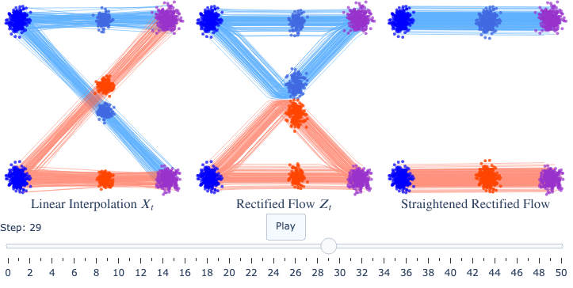
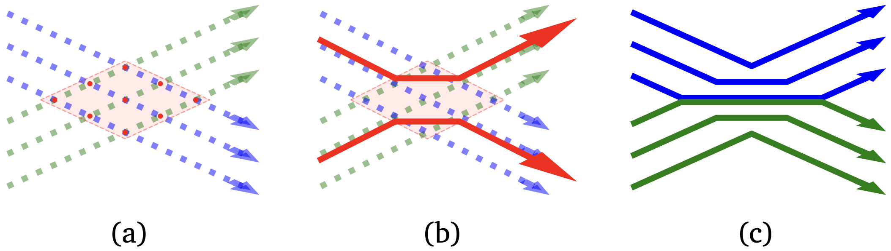

Rectified Flow 通过将一个平滑连接噪声与数据的插值过程"因果化"（或称为校正）来学习常微分方程 (ODE) 生成模型。该过程自然倾向于产生更直的轨迹，从而使得快速的欧拉离散化成为可能，并且这一过程可以重复进行，以进一步提高轨迹的直性。

### 目录

- 概述
- 问题：学习流生成模型
- Rectified Flow
- Reflow

## 概述

本文提供了对 Rectified Flow 的简要介绍，内容基于讲义第一章。更多介绍请参阅原始论文和相关博客。

## 问题：学习流生成模型

生成建模可以被表述为寻找一种计算过程，将一个噪声分布（记作 $\pi_0$）转化为一个通过数据观察到的未知数据分布 $\pi_1$。在流模型中，这个过程由常微分方程 (ODE) 表示：

$$
\dot{Z}_t = v_t(Z_t), \quad \forall t \in [0,1], \quad \text{起始于 } Z_0 \sim \pi_0 \tag{1}
$$

其中 $\dot{Z}_t = \dfrac{dZ_t}{dt}$ 表示时间导数，而速度场 $v_t(x) = v(x,t)$ 是一个待学习的函数，其目的是确保从 $Z_0 \sim \pi_0$ 出发时，$Z_1$ 能够遵循目标分布 $\pi_1$。在这种情况下，我们称随机过程 $Z=\{Z_t\}$ 提供了从 $\pi_0$ 到 $\pi_1$ 的（ODE）传输。

需要注意的是，除平凡情况外，只要存在至少一种这样的传输，就会有**无限多种** ODE 传输从 $\pi_0$ 到 $\pi_1$。因此，明确我们应当偏好哪种类型的 ODE 非常关键。

一种选择是偏好那些在推理时**易于**求解的 ODE。实际上，ODE 通常通过数值方法进行近似求解，这些方法通常构造 ODE 轨迹的**分段线性**近似。例如，一个常见的选择是欧拉方法：

$$
\hat{Z}_{t+\epsilon} = \hat{Z}_t + \epsilon\, v_t(\hat{Z}_t), \quad \forall t \in \{0, \epsilon, 2\epsilon, \dots, 1\} \tag{2}
$$

其中 $ \epsilon > 0 $ 是步长。调整步长 $ \epsilon $ 会在精度和计算成本之间构成权衡：较小的 $ \epsilon $ 能提高精度，但需要更多的计算步骤。因此，我们应追求那些即便在较大步长下也能精确近似的 ODE。

***图1.** Lady Windermere's fan 图示了欧拉方法轨迹的误差累积情况：不同初始点的轨迹随着时间偏离真实解曲线。*

理想情况是当 ODE 轨迹完全为直线时，欧拉法可实现**零离散化误差**，而不受步长选择的影响。在这种情况下，经时间重参数化后，ODE 应满足：

$$
Z_t = t\,Z_1 + (1-t)\,Z_0, \quad \implies \quad \dot{Z}_t = Z_1 - Z_0
$$

这些 ODE 被称为**直线传输**，它们能够实现可在一步内模拟的**快速**生成模型。我们将所得的对 $ (Z_0,Z_1) $ 称为 $ \pi_0 $ 与 $ \pi_1 $ 的直线耦合。尽管在实际中可能无法达到完美直线性，但我们可以尽量使 ODE 轨迹直，从而最大化计算效率。

> **耦合（Coupling）的数学定义与作用**
> 在概率论中，两个分布 $ \pi_0 $ 和 $ \pi_1 $ 的**耦合**是指它们的联合概率分布 $ \gamma(x_0, x_1) $，满足：
>
> $$
> \int \gamma(x_0, x_1) dx_1 = \pi_0(x_0), \quad \int \gamma(x_0, x_1) dx_0 = \pi_1(x_1)
> $$
>
> 即边缘分布分别为 $ \pi_0 $ 和 $ \pi_1 $。
>
> **在Rectified Flow中的意义**
>
> 1. **轨迹构造基础**
>    耦合 $(X_0, X_1) \sim \gamma$ 定义了噪声样本 $X_0 \sim \pi_0$ 与数据样本 $X_1 \sim \pi_1$ 的配对关系，进而通过插值生成中间轨迹：
>    $$
>    X_t = t X_1 + (1-t) X_0
>    $$
> 2. **影响ODE直线性**
>    不同的耦合会导致不同的插值轨迹形态：
>
>    - **独立耦合**：$X_0$ 与 $X_1$ 独立采样（$\gamma = \pi_0 \times \pi_1$），轨迹易交叉（图2a）
>    - **直线耦合**：存在双射 $X_1 = F(X_0) $，使得所有轨迹为直线（理想情况）
>
> **关键耦合类型对比**
>
> | 耦合类型                | 数学形式                          | 轨迹特性           | 生成效率         |
> | ----------------------- | --------------------------------- | ------------------ | ---------------- |
> | **独立耦合**      | $\gamma = \pi_0 \times \pi_1$ | 多交叉，曲率大     | 低（需多步采样） |
> | **Straight耦合**  | $X_1 = X_0 + v(X_0)$          | 无交叉，完全直线   | 高（单步生成）   |
> | **Rectified耦合** | 通过Reflow迭代优化                | 渐进直化，交叉减少 | 逐步提升         |
> 
> **耦合优化的核心思想**
> Rectified Flow通过以下步骤优化耦合：
> 
> 1. **初始独立耦合**：从独立样本对 \( (X_0, X_1) \) 开始
> 2. **校正速度场**：学习 \( v_t^*(x) = \mathbb{E}[X_1 - X_0 \mid X_t = x] \)
> 3. **生成新耦合**：通过ODE \( \dot{Z}_t = v_t^*(Z_t) \) 得到 \( (Z_0, Z_1) \)
> 4. **迭代直化**：将 \( (Z_0, Z_1) \) 作为新耦合输入Reflow过程
> 
> **示例**：
> 若初始耦合为独立分布，经过一次Rectify后，新耦合 $(Z_0, Z_1)$ 满足：
> $$
> Z_1 = Z_0 + \int_0^1 v_t^*(Z_t) dt
> $$
> 这种耦合的直线性显著优于初始独立耦合。

## Rectified Flow

为了构造一个从 $\pi_0$ 到 $\pi_1$ 的流，假设我们获得了一个任意耦合 $(X_0, X_1)$（例如，$\pi_0 \times \pi_1$ 的**独立耦合**，这是当我们可以获取 $\pi_0$ 和 $\pi_1$ 独立样本时常见的情况）。基本思路是将 $(X_0, X_1)$ 转换为由 ODE 模型生成的更优耦合。我们还可以选择性地重复这一过程，以进一步提升诸如直线性等目标属性。

Rectified Flow 的构造方法如下：

* **构建插值：**

  首先，构建一个插值过程 $\{X_t\} = \{X_t: t \in [0,1]\}$，在 $X_0$ 与 $X_1$ 之间平滑过渡。虽然可以选择其它插值方式，但这里我们采用典型的直线插值：

  $$
  X_t = t\,X_1 + (1-t)\,X_0
  $$

  这种插值过程 $\{X_t\}$ 是通过 **"锚定-桥接"** 方式生成的：首先采样端点 $X_0$ 与 $X_1$，然后生成连接这两者的中间轨迹。
* **边际匹配：**

  通过上述构造，插值过程 $\{X_t\}$ 的端点 $X_0$ 和 $X_1$ 自然匹配目标分布 $\pi_0$ 与 $\pi_1$。但是，$\{X_t\}$ 并不是一个 **因果** 的 ODE 过程（比如 $\dot{Z}_t = v_t(Z_t)$），后者是通过从 $Z_0$ 随时间前进生成 $Z_1$。生成 $X_t$ 则需要同时依赖 $X_0$ 和 $X_1$，而非仅从 $X_0$ 随 $t$ 增加而演化。
* **速度场估计：**

  为了将插值过程转换为 ODE 流，我们需要学习一个速度场 $v_t$，使得它能近似 $X_t$ 的时间导数 $\dot{X}_t$。为此，我们求解如下优化问题：

  $$
  \min_v \int_0^1 \mathbb{E}\Bigl[\|\dot{X}_t - v(X_t,t)\|^2\Bigr] dt.
  $$

  其中 $v$ 通常使用深度神经网络进行参数化，期望项关于插值轨迹取样。

  > **符号说明。** 一个随机过程 $X_t = X(t,\omega)$ 是关于时间 $t$ 及随机种子 $\omega$ 的可测函数（随机种子的分布记作 $\mathbb{P}$）。在这里，端点 $(X_0,X_1)$ 就构成了随机种子；而 $\dot{X}_t = \partial_t X(t,\omega)$ 是关于 $t$ 的偏导数，同样依赖于同一随机种子。通常我们在书写时会省略随机种子的符号。
  >

  这一优化问题的最优解为条件均值：

  $$
  v_t^*(x) = \mathbb{E}\bigl[\dot{X}_t \mid X_t = x\bigr].
  $$
---
## 补充证明
让我用更规范的 LaTeX 格式重新解释这个证明：

### 证明 \[v_t^*(x) = \mathbb{E}[\dot{X}_t|X_t=x]\] 是优化问题的解

原优化问题：
\[\min_v \int_0^1 \mathbb{E}[\|\dot{X}_t - v_t(X_t)\|^2]dt\]

### 证明步骤

1) 由于积分是在时间维度上的，我们可以对每个时间点 t 分别求最小值：
   \[\min_v \mathbb{E}[\|\dot{X}_t - v_t(X_t)\|^2]\]

2) 令 \[v_t^*(x) = \mathbb{E}[\dot{X}_t|X_t=x]\]，定义偏差函数：
   \[h(x) = v_t(x) - v_t^*(x)\]

3) 展开均方误差：
   \[\begin{aligned}
   \mathbb{E}[\|\dot{X}_t - v_t(X_t)\|^2] &= \mathbb{E}[\|\dot{X}_t - v_t^*(X_t) + v_t^*(X_t) - v_t(X_t)\|^2] \\
   &= \mathbb{E}[\|\dot{X}_t - v_t^*(X_t)\|^2] + \mathbb{E}[\|h(X_t)\|^2] + 2\mathbb{E}[(\dot{X}_t - v_t^*(X_t))^T h(X_t)]
   \end{aligned}\]

4) 考虑交叉项：
   - 由条件期望定义：\[\mathbb{E}[\dot{X}_t - v_t^*(X_t)|X_t] = 0\]
   - 因此：\[\mathbb{E}[(\dot{X}_t - v_t^*(X_t))^T h(X_t)] = 0\]

5) 整理得到：
   \[\mathbb{E}[\|\dot{X}_t - v_t(X_t)\|^2] = \mathbb{E}[\|\dot{X}_t - v_t^*(X_t)\|^2] + \mathbb{E}[\|h(X_t)\|^2]\]

6) 由于 \[\mathbb{E}[\|h(X_t)\|^2] \geq 0\]，且当且仅当 \[h(x) = 0\] 时取等号，即：
   \[v_t(x) = v_t^*(x) = \mathbb{E}[\dot{X}_t|X_t=x]\]

7) 因此，\[v_t^*(x) = \mathbb{E}[\dot{X}_t|X_t=x]\] 是优化问题的最优解。

### 直观理解

- 在每个空间点 x，速度场 \[v_t(x)\] 需要最小化与所有经过该点轨迹实际速度 \[\dot{X}_t\] 的均方差
- 条件期望 \[\mathbb{E}[\dot{X}_t|X_t=x]\] 正是最小化均方差的最优选择
- 这相当于在每个点选择一个最能代表所有可能运动方向的"平均方向"
- 任何偏离这个条件期望的选择都会导致更大的均方误差

这就是为什么条件期望 \[\mathbb{E}[\dot{X}_t|X_t=x]\] 是最优解。

---
  对于直线插值 $X_t = t\,X_1 + (1-t)\,X_0$，我们有 $\dot{X}_t = X_1 - X_0$（即对 $t$ 求导后为常数）。因此，最优速度场为

  $$
  v_t^*(x) = \mathbb{E}[X_1 - X_0 \mid X_t=x],
  $$

  且在这种直线插值中，这一结果与 $t$ 无关。

  

  ***图2.** 图中展示了从 $\pi_0$ 到 $\pi_1$ 的 Rectified Flow。蓝色和粉色轨迹表示不同模式的轨迹，便于可视化。*

  **直观解释：**

  - 在插值过程 $\{X_t\}$ 中，不同轨迹可能相交，因而在某一点 $X_t$ 处可能得到多个不同的 $\dot{X}_t$ 值（参见图2a）。
  - 相比之下，在由 $\dot{Z}_t = v_t^*(Z_t)$ 定义的 ODE 中，每个点 $Z_t$ 的更新方向是唯一确定的，这避免了交叉后方向分叉的情况。
  - 所以，在交叉点处，ODE 通过采用条件均值 $v_t^*(x)$ 来"去随机化"更新方向，从而将各插值轨迹重构为不交叉的路径（参见图2b）。
  - 由于 ODE 轨迹 $\{Z_t\}$ 不能相交，它们必须在潜在的交叉点处弯曲，以"重连"原始插值路径并避免交叉。

  > **Rectified Flow.** 对于任一可微随机过程 $\{X_t\} = \{X_t:t\in[0,1]\}$，我们将下式定义的 ODE 过程
  >
  > $$
  > \dot{Z}_t = v_t^*(Z_t) \quad \text{with} \quad v_t^*(x) = \mathbb{E} \left[ \dot{X}_t \mid X_t = x \right], \quad Z_0 = X_0
  > $$
  >
  > 称为由 $\{X_t\}$ 诱导出的 **Rectified Flow**。我们记为：
  >
  > $$
  > \{Z_t\} = \texttt{Rectify}(\{X_t\}).
  > $$
  >

 
  **图3.** 展示了校正如何"重连"插值轨迹的近距离视图：(a) 显示了存在交叉的插值轨迹；(b) 在交叉点处展示了平均速度方向（以红色箭头表示）；(c) 显示了校正后得到的 ODE 流轨迹。

  图3 直观展示了校正如何"重连"插值轨迹。考虑两束插值轨迹相交形成的"混淆区"（中间阴影区域）。在此区域内，沿 Rectified Flow 移动的粒子遵循平均速度 $ v_t^* $；一旦粒子离开混淆区，它便根据退出侧重合到某条原始插值轨迹并继续沿该方向运动。由于在混淆区内 Rectified Flow 轨迹不会交叉，它们始终保持分离，并从不同侧退出，从而有效地"重连"了原始插值轨迹。

---
### 是什么使得 Rectified Flow 更直？

为了理解 Rectified Flow 为什么倾向于生成更直的轨迹，让我们考虑一个简单的例子。假设在某个时刻 $t$ 和位置 $x$ 处，有两条插值轨迹相交。这意味着有两对端点 $(X_0^{(1)}, X_1^{(1)})$ 和 $(X_0^{(2)}, X_1^{(2)})$，它们的插值轨迹在 $(t,x)$ 处相交。在这一点上：

- 第一条轨迹的速度为 $\dot{X}_t^{(1)} = X_1^{(1)} - X_0^{(1)}$
- 第二条轨迹的速度为 $\dot{X}_t^{(2)} = X_1^{(2)} - X_0^{(2)}$

然而，Rectified Flow 在这一点的速度是这两个速度的平均值：

$$
v_t^*(x) = \mathbb{E}[\dot{X}_t \mid X_t = x] = \frac{\dot{X}_t^{(1)} + \dot{X}_t^{(2)}}{2}
$$

这种平均化效应有两个重要的结果：

1. **轨迹不交叉**：由于在每个点处速度场都是唯一的，ODE 轨迹不能相交。这是因为如果两条轨迹在某点相遇，它们将遵循相同的速度场，因此要么合并，要么永远不会相交。

2. **轨迹更直**：考虑一个轨迹在某点处的曲率。曲率越大，轨迹的速度方向变化就越剧烈。但是由于速度场是通过平均多个轨迹的速度得到的，这种平均化倾向于使速度场更加平滑，从而减小曲率。

这种平滑化效应在整个空间中都在发生，不仅仅是在交叉点处。在任何给定点，速度场都是所有经过该点的插值轨迹速度的平均值。这种全局平均化导致了更平滑、更直的轨迹。

### 3.1 边缘分布保持性质

边缘分布保持性质指的是：对于 $\forall t$，$Law(Z_t) = Law(X_t)$ 是非线性整流流在(6)中的一般性质，无论插值过程 $X_t$ 是否为直线 [3]。

**定义 3.1** 对于一个路径连续可微的随机过程 $X = \{X_t : t \in [0,1]\}$，其期望速度 $v^X$ 定义为：
$$v^X(x,t) = \mathbb{E}[\dot{X_t}|X_t = x], \quad \forall x \in supp(X_t)$$

对于 $x \notin supp(X_t)$，条件期望未定义，我们任意设定 $v^X(x,t) = 0$。

**定义 3.2** 如果 $v^X$ 是局部有界的，且下面的积分方程存在唯一解，我们称 X 是可整流的：
$$Z_t = Z_0 + \int_0^t v^X(Z_s,s)ds, \quad \forall t \in [0,1], \quad Z_0 = X_0$$

在这种情况下，$Z = \{Z_t : t \in [0,1]\}$ 被称为由 X 诱导的整流流。

**定理 3.3** 假设 X 是可整流的，Z 是其整流流。则对所有 $t \in [0,1]$ 有：$Law(Z_t) = Law(X_t)$。

**证明** 对于任意紧支撑的连续可微测试函数 $h: \mathbb{R}^d \to \mathbb{R}$，我们有：
$$\frac{d}{dt}\mathbb{E}[h(X_t)] = \mathbb{E}[\nabla h(X_t)^T \dot{X_t}] = \mathbb{E}[\nabla h(X_t)^T v^X(X_t,t)]$$

这里我们用到了 $v^X(X_t,t) = \mathbb{E}[\dot{X_t}|X_t]$。根据定义，这等价于 $\pi_t := Law(X_t)$ 在分布意义下求解具有漂移 $v^X_t := v^X(\cdot,t)$ 的连续性方程：
$$\dot{\pi_t} + \nabla \cdot (v^X_t \pi_t) = 0$$

要看到(10)和(11)的等价性，我们可以将(11)两边乘以 h 并积分：
$$\begin{aligned}
0 &= \int h(\dot{\pi_t} + \nabla \cdot (v^X_t \pi_t)) \\
&= \int h\dot{\pi_t} - \nabla h^T v^X_t \pi_t \\
&= \frac{d}{dt}\mathbb{E}[h(X_t)] - \mathbb{E}[\nabla h(X_t)^T v^X(X_t,t)]
\end{aligned}$$

这里我们用到了分部积分：$$\int h\nabla \cdot (v^X_t \pi_t) = -\int \nabla h^T(v^X_t \pi_t)$$

因为 $Z_t$ 由相同的速度场 $v^X$ 驱动，其边缘分布 $Law(Z_t)$ 求解相同的方程且具有相同的初始条件($Z_0 = X_0$)。因此，如果方程(11)的解是唯一的，$Law(Z_t)$ 和 $Law(X_t)$ 的等价性就成立了。而(11)解的唯一性等价于 $dZ_t = v^X(Z_t,t)dt$ 解的唯一性，这可以由 Kurtz [37] 的推论 1.3 得到（另见 Ambrosio 和 Crippa [1] 的定理 4.1）。

---
第二步是利用向量函数求导的性质。原始的性质是复合函数的链式法则，适用于标量函数对向量的求导。

具体来说，对于复合函数 $h(X_t)$，其中 $h: \mathbb{R}^d \to \mathbb{R}$ 是标量函数，$X_t: \mathbb{R} \to \mathbb{R}^d$ 是向量值函数，复合函数对时间 $t$ 的导数遵循以下链式法则：

$$\frac{d}{dt}h(X_t) = \sum_{i=1}^d \frac{\partial h(X_t)}{\partial (X_t)_i} \cdot \frac{d(X_t)_i}{dt}$$

这可以用向量形式更简洁地表示为：

$$\frac{d}{dt}h(X_t) = \nabla h(X_t)^{\top} \dot{X}_t$$

其中：
- $\nabla h(X_t)$ 是函数 $h$ 在点 $X_t$ 处的梯度，即 $\nabla h(X_t) = \left(\frac{\partial h}{\partial x_1}, \frac{\partial h}{\partial x_2}, \ldots, \frac{\partial h}{\partial x_d}\right)^{\top}$ 在 $X_t$ 处的值
- $\dot{X}_t = \frac{dX_t}{dt}$ 是向量 $X_t$ 对时间 $t$ 的导数
  
---
## Reflow

尽管 Rectified Flow 倾向于生成更直的轨迹，但这些轨迹并不完全是直线。正如图2(a)所示，在插值轨迹的交叉点处，流仍可能发生转弯。那么，我们如何进一步提升流，使得轨迹更直，从而加速推理？

一个关键的见解是，Rectified Flow 生成的起止对 $ (Z_0, Z_1) $（也称为 **Rectified Coupling**）相比原始耦合 $ (X_0, X_1) $ 更优、更"直"。这是因为如果我们用直线插值重新连接 $ Z_0 $ 与 $ Z_1 $，那么得到的轨迹将交叉得更少。因此，通过基于重新插值耦合训练一个新的 Rectified Flow，我们能够进一步使轨迹直化，从而实现更快的采样推理。

形式上，我们递归应用 $ \texttt{Rectify}(\cdot) $ 操作，从 $ (Z_0^0, Z_1^0) = (X_0, X_1) $ 开始，得到一系列 Rectified Flow：

$$
\texttt{Reflow:} \quad \{Z_t^{k+1}\} = \texttt{Rectify}(\texttt{Interp}(Z_0^k, Z_1^k)),
$$

其中 $ \texttt{Interp}(Z_0^k, Z_1^k) $ 表示利用 $ (Z_0^k, Z_1^k) $ 构造的插值过程。我们将 $ \{Z_t^k\} $ 称为第 $ k $ 个 Rectified Flow，简称为 **$ k $-Rectified Flow**，它是由 $ (X_0, X_1) $ 诱导得到的。

这一 Reflow 过程被证明在以下意义上能使轨迹更直。我们定义流的直性量度为

$$
S(\{Z_t\}) = \int_0^1 \mathbb{E}\Bigl[\|Z_1 - Z_0 - \dot{Z}_t\|^2\Bigr] dt,
$$

其中 $ S(\{Z_t\}) = 0 $ 表示轨迹完全为直线。研究表明，

$$
\mathbb{E}_{k \sim \mathrm{Unif}(\{1,\dots,K\})\Bigr[S(\{Z_t^k\})\Bigr] = \mathcal{O}\Bigl(\frac{1}{K}\Bigr),
$$

这意味着在前 $ K $ 次迭代中，直性量度的平均值以 $ \mathcal{O}(1/K) $ 的速率衰减。

需要注意的是，Reflow 可以从任一耦合 $ (X_0, X_1) $ 开始，因此它提供了一种普适的直化（加速）方法，同时保留边际分布不变。

> **Reflow 与捷径学习。** 直观上，Reflow 类似于人类的捷径学习：一旦首次解决了某个问题，我们便学会了直接走捷径，从而在下一次能够更快地得到解答。

## 理论推导

在本节中，我们将严格证明为什么优化目标：

$$\mathbb{E}_{x_0\sim \pi_0, x_1\sim \pi_1} \left[\|v_\theta(x_t,t) - \frac{\partial}{\partial t}\varphi_t(x_0,x_1)\|^2\right]$$

会导出最优速度场 $v_t^*(x) = \mathbb{E}[\dot{X}_t \mid X_t = x]$，从而构建满足所需边际分布的ODE：

$$\frac{dx_t}{dt}=v_t^*(x_t)$$

### 基本假设

- 假设存在轨迹 $x_t=\varphi_t(x_0,x_1)$，这对应于我们的直线插值 $X_t = t X_1 + (1-t) X_0$
- 假设该轨迹关于 $x_1$ 是可逆的，即可以解出 $x_1=\psi_t(x_0,x_t)$

### 期望表达式推导

从测试函数的角度开始分析。给定任意光滑测试函数 $\phi$，考虑其在时间 $t+\Delta t$ 处的期望：

$$\mathbb{E}_{x_{t+\Delta t}}[\phi(x_{t+\Delta t})] = \mathbb{E}_{x_0,x_1}[\phi(\varphi_{t+\Delta t}(x_0,x_1))]$$

通过泰勒展开到一阶：

$$\mathbb{E}_{x_0,x_1}\left[\phi(\varphi_t(x_0,x_1)) + \Delta t\frac{\partial \varphi_t(x_0,x_1)}{\partial t}\cdot\nabla_{\varphi_t}\phi(\varphi_t(x_0,x_1))\right] + o(\Delta t)$$

这可以重写为：

$$\mathbb{E}_{x_0,x_1}[\phi(x_t)] + \Delta t\mathbb{E}_{x_0,x_1}\left[\frac{\partial \varphi_t(x_0,x_1)}{\partial t}\cdot\nabla_{x_t}\phi(x_t)\right] + o(\Delta t)$$

注意到 $x_t = \varphi_t(x_0,x_1)$，上式可表示为：

$$\mathbb{E}_{x_t}[\phi(x_t)] + \Delta t\mathbb{E}_{x_0,x_t}\left[\frac{\partial \varphi_t(x_0,x_1)}{\partial t}\cdot\nabla_{x_t}\phi(x_t)\right] + o(\Delta t)$$

### 条件期望引入

> **条件期望的性质说明：**
> 
> 在这一步中，我们使用了条件期望的以下关键性质：
> 
> 1. **全期望公式（Law of Total Expectation）**：对于任意随机变量 $X$ 和 $Y$，以及可积函数 $g$，有
>    $$\mathbb{E}[g(X)] = \mathbb{E}[\mathbb{E}[g(X)|Y]]$$
>    
> 2. **条件期望的线性性**：对于随机变量 $X$、$Y$ 和函数 $g_1$、$g_2$，有
>    $$\mathbb{E}[a g_1(X) + b g_2(X)|Y] = a\mathbb{E}[g_1(X)|Y] + b\mathbb{E}[g_2(X)|Y]$$
>    
> 3. **条件期望与确定性变量的分离**：若 $h(Y)$ 是 $Y$ 的函数，则
>    $$\mathbb{E}[h(Y)g(X)|Y] = h(Y)\mathbb{E}[g(X)|Y]$$
>    
> 在我们的推导中，将 $\mathbb{E}_{x_0,x_t}[\frac{\partial \varphi_t}{\partial t}\cdot\nabla_{x_t}\phi(x_t)]$ 改写为条件期望形式时，我们应用了上述性质：
> 
> - 首先，注意到 $\nabla_{x_t}\phi(x_t)$ 只依赖于 $x_t$，因此在给定 $x_t$ 的条件下是确定的
> - 应用性质3，可将其从条件期望中分离出来：
>   $$\mathbb{E}_{x_0,x_t}\left[\frac{\partial \varphi_t}{\partial t}\cdot\nabla_{x_t}\phi(x_t)\right] = \mathbb{E}_{x_t}\left[\mathbb{E}_{x_0|x_t}\left[\frac{\partial \varphi_t}{\partial t}\right]\cdot\nabla_{x_t}\phi(x_t)\right]$$
> 
> 这一变换是推导ODE形式的关键步骤，它使我们能够将条件期望 $\mathbb{E}_{x_0|x_t}[\frac{\partial \varphi_t}{\partial t}]$ 识别为最优速度场。

利用条件期望的性质，可以将表达式改写为：

$$\mathbb{E}_{x_t}[\phi(x_t)] + \Delta t\mathbb{E}_{x_t}\left[\mathbb{E}_{x_0|x_t}\left[\frac{\partial \varphi_t(x_0,x_1)}{\partial t}\right]\cdot\nabla_{x_t}\phi(x_t)\right] + o(\Delta t)$$

根据泰勒展开的逆向应用，这等价于：

$$\mathbb{E}_{x_t}\left[\phi\left(x_t + \Delta t\mathbb{E}_{x_0|x_t}\left[\frac{\partial \varphi_t(x_0,x_1)}{\partial t}\right]\right)\right] + o(\Delta t)$$

### ODE 推导

由于上述等式对任意测试函数 $\phi$ 成立，我们可以得到：

$$x_{t+\Delta t} \approx x_t + \Delta t\mathbb{E}_{x_0|x_t}\left[\frac{\partial \varphi_t(x_0,x_1)}{\partial t}\right]$$

当 $\Delta t \rightarrow 0$ 时，这正是如下ODE：

$$\frac{dx_t}{dt} = \mathbb{E}_{x_0|x_t}\left[\frac{\partial \varphi_t(x_0,x_1)}{\partial t}\right]$$

对于线性插值 $\varphi_t(x_0,x_1) = t x_1 + (1-t) x_0$，我们有 $\frac{\partial \varphi_t}{\partial t} = x_1 - x_0$，因此：

$$\frac{dx_t}{dt} = \mathbb{E}_{x_0|x_t}[x_1 - x_0] = v_t^*(x_t)$$

### 最优解证明

根据期望的性质：

$$\mathbb{E}[X] = \arg\min_{\mu} \mathbb{E}[\|X-\mu\|^2]$$

这表明条件期望 $\mathbb{E}_{x_0|x_t}[\frac{\partial \varphi_t}{\partial t}]$ 正是优化目标：

$$\min_v \mathbb{E}\left[\left\|\frac{\partial \varphi_t}{\partial t} - v(x_t,t)\right\|^2\right]$$

的最优解。换言之，当 $v_\theta(x,t)$ 逼近条件期望 $\mathbb{E}[\dot{X}_t|X_t=x]$ 时，我们的学习会得到最优结果。这正是前述最优速度场的理论依据：

$$v_t^*(x) = \mathbb{E}[X_1 - X_0 \mid X_t=x]$$

---

*引用自原文：[Rectified Flow: Straight is Fast](https://rectifiedflow.github.io/blog/2024/intro/)*

---

# 条件期望与确定性变量的分离

您问到的是条件期望与确定性变量分离性质中的期望符号含义及其推导。我来详细解释：

## 性质表述

在条件期望与确定性变量的分离性质中：

$$\mathbb{E}[h(Y)g(X)|Y] = h(Y)\mathbb{E}[g(X)|Y] \tag{17}$$

这里的 $\mathbb{E}[\cdot|Y]$ 表示在给定随机变量 $Y$ 的条件下的期望。具体来说：

- 这是对随机变量 $X$ 的条件分布 $P(X|Y)$ 计算的期望
- $h(Y)$ 是 $Y$ 的函数
- $g(X)$ 是 $X$ 的函数

## 推导过程

这个性质的推导基于条件期望的基本定义。对于连续随机变量，条件期望定义为：

$$\mathbb{E}[Z|Y=y] = \int z \cdot f_{Z|Y}(z|y) dz \tag{18}$$

其中 $f_{Z|Y}(z|y)$ 是在 $Y=y$ 条件下 $Z$ 的条件概率密度函数。

现在，让我们考虑 $Z = h(Y)g(X)$，即我们想求 $\mathbb{E}[h(Y)g(X)|Y=y]$：

$$\mathbb{E}[h(Y)g(X)|Y=y] = \int h(Y)g(x) \cdot f_{X|Y}(x|y) dx \tag{19}$$

由于在条件 $Y=y$ 下，$h(Y)$ 是一个确定的值 $h(y)$（不再是随机变量），所以它可以从积分中提出来：

$$\mathbb{E}[h(Y)g(X)|Y=y] = h(y) \int g(x) \cdot f_{X|Y}(x|y) dx = h(y) \cdot \mathbb{E}[g(X)|Y=y] \tag{20}$$

这就得到了 $\mathbb{E}[h(Y)g(X)|Y=y] = h(y)\mathbb{E}[g(X)|Y=y]$。

将 $Y=y$ 推广到随机变量 $Y$，我们得到：

$$\mathbb{E}[h(Y)g(X)|Y] = h(Y)\mathbb{E}[g(X)|Y] \tag{21}$$

## 在我们的推导中的应用

在公式 (6) 到 (7) 的转换中，我们使用了这个性质：

从：
$$\mathbb{E}_{x_t}[\phi(x_t)] + \Delta t\mathbb{E}_{x_0,x_1|x_t}\left[\frac{\partial \varphi_t(x_0,x_1)}{\partial t}\cdot\nabla_{x_t}\phi(x_t)\right] + o(\Delta t) \tag{6}$$

到：
$$\mathbb{E}_{x_t}[\phi(x_t)] + \Delta t\mathbb{E}_{x_t}\left[\mathbb{E}_{x_0|x_t}\left[\frac{\partial \varphi_t(x_0,\psi_t(x_0,x_t))}{\partial t}\right]\cdot\nabla_{x_t}\phi(x_t)\right] + o(\Delta t) \tag{7}$$

这里：
- $Y$ 对应于 $x_t$
- $X$ 对应于 $x_0$（注意 $x_1$ 可以通过 $x_0$ 和 $x_t$ 确定为 $\psi_t(x_0,x_t)$）
- $h(Y)$ 对应于 $\nabla_{x_t}\phi(x_t)$，它只依赖于 $x_t$
- $g(X)$ 对应于 $\frac{\partial \varphi_t(x_0,\psi_t(x_0,x_t))}{\partial t}$

因此，在给定 $x_t$ 的条件下，$\nabla_{x_t}\phi(x_t)$ 是一个确定的值，可以从条件期望中提出来，得到：

$$\mathbb{E}_{x_0,x_1|x_t}\left[\frac{\partial \varphi_t(x_0,x_1)}{\partial t}\cdot\nabla_{x_t}\phi(x_t)\right] = \nabla_{x_t}\phi(x_t) \cdot \mathbb{E}_{x_0|x_t}\left[\frac{\partial \varphi_t(x_0,\psi_t(x_0,x_t))}{\partial t}\right] \tag{22}$$

这正是我们在推导中使用的条件期望与确定性变量分离的性质。

-----

# 最优解证明中的期望性质解析

在最优解证明过程中，我们使用了期望的一个重要性质，我来详细解释这个性质及其在证明中的应用。

## 期望的线性性质

期望的线性性质是指：对于随机变量 $X$ 和 $Y$，以及常数 $a$ 和 $b$，有：

$$\mathbb{E}[aX + bY] = a\mathbb{E}[X] + b\mathbb{E}[Y]$$

这个性质可以扩展到任意有限个随机变量的线性组合。

## 在最优解证明中的应用

在最优解证明中，我们需要最小化以下形式的期望：

$$\mathbb{E}_{x_0,x_1,x_t}\left[\left\| \frac{\partial \varphi_t(x_0,x_1)}{\partial t} - s_\theta(x_t,t) \right\|^2\right]$$

展开平方项，我们得到：

$$\mathbb{E}_{x_0,x_1,x_t}\left[\left\|\frac{\partial \varphi_t(x_0,x_1)}{\partial t}\right\|^2 - 2\left\langle\frac{\partial \varphi_t(x_0,x_1)}{\partial t}, s_\theta(x_t,t)\right\rangle + \left\|s_\theta(x_t,t)\right\|^2\right]$$

根据期望的线性性质，上式等于：

$$\mathbb{E}_{x_0,x_1,x_t}\left[\left\|\frac{\partial \varphi_t(x_0,x_1)}{\partial t}\right\|^2\right] - 2\mathbb{E}_{x_0,x_1,x_t}\left[\left\langle\frac{\partial \varphi_t(x_0,x_1)}{\partial t}, s_\theta(x_t,t)\right\rangle\right] + \mathbb{E}_{x_0,x_1,x_t}\left[\left\|s_\theta(x_t,t)\right\|^2\right]$$

## 全期望公式的应用

接下来，我们应用全期望公式处理第二项：

$$\mathbb{E}_{x_0,x_1,x_t}\left[\left\langle\frac{\partial \varphi_t(x_0,x_1)}{\partial t}, s_\theta(x_t,t)\right\rangle\right] = \mathbb{E}_{x_t}\left[\mathbb{E}_{x_0,x_1|x_t}\left[\left\langle\frac{\partial \varphi_t(x_0,x_1)}{\partial t}, s_\theta(x_t,t)\right\rangle\right]\right]$$

## 条件期望与确定性变量分离

由于 $s_\theta(x_t,t)$ 只依赖于 $x_t$ 和 $t$，在给定 $x_t$ 的条件下，它是一个确定的值。根据条件期望与确定性变量分离的性质，我们有：

$$\mathbb{E}_{x_0,x_1|x_t}\left[\left\langle\frac{\partial \varphi_t(x_0,x_1)}{\partial t}, s_\theta(x_t,t)\right\rangle\right] = \left\langle\mathbb{E}_{x_0,x_1|x_t}\left[\frac{\partial \varphi_t(x_0,x_1)}{\partial t}\right], s_\theta(x_t,t)\right\rangle$$

这里使用了内积的线性性质和条件期望的性质。

## 最优解的推导

当我们要最小化上述期望表达式时，只有第二项和第三项包含了我们的优化目标 $s_\theta(x_t,t)$。第一项是一个常数，与 $s_\theta$ 无关。

为了最小化整个表达式，我们需要：
1. 最大化第二项：$2\mathbb{E}_{x_0,x_1,x_t}\left[\left\langle\frac{\partial \varphi_t(x_0,x_1)}{\partial t}, s_\theta(x_t,t)\right\rangle\right]$
2. 最小化第三项：$\mathbb{E}_{x_0,x_1,x_t}\left[\left\|s_\theta(x_t,t)\right\|^2\right]$

根据上面的推导，最优的 $s_\theta(x_t,t)$ 应该等于：

$$s_\theta^*(x_t,t) = \mathbb{E}_{x_0,x_1|x_t}\left[\frac{\partial \varphi_t(x_0,x_1)}{\partial t}\right]$$

这个结果可以通过变分法或直接对 $s_\theta(x_t,t)$ 求导并令其等于零来证明。

## 总结

在最优解证明中，我们主要使用了以下期望性质：
1. 期望的线性性质：$\mathbb{E}[X + Y] = \mathbb{E}[X] + \mathbb{E}[Y]$
2. 全期望公式：$\mathbb{E}[X] = \mathbb{E}[\mathbb{E}[X|Y]]$
3. 条件期望与确定性变量分离：$\mathbb{E}[h(Y)g(X)|Y] = h(Y)\mathbb{E}[g(X)|Y]$
4. 内积的线性性质：$\langle a + b, c \rangle = \langle a, c \rangle + \langle b, c \rangle$

这些性质共同帮助我们推导出了最优的分数匹配模型 $s_\theta^*(x_t,t)$。