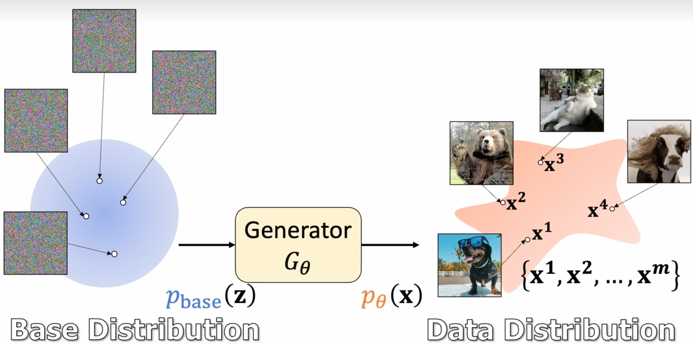
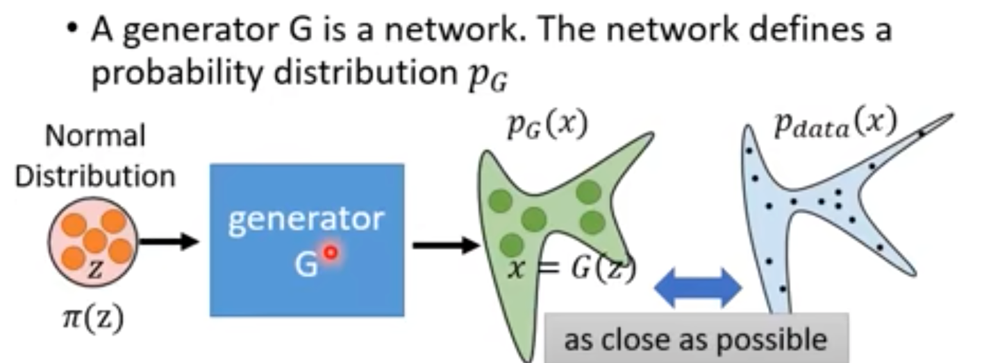
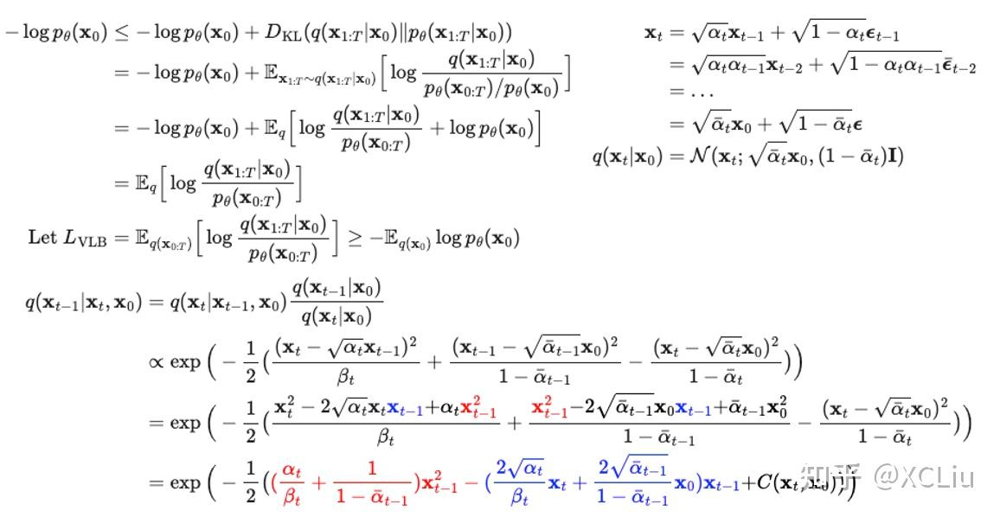
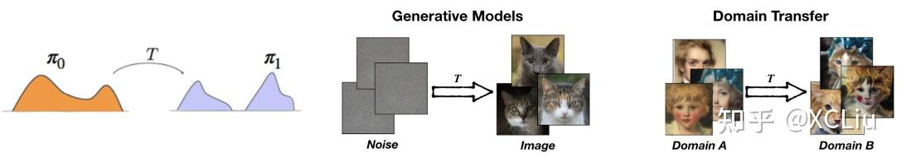
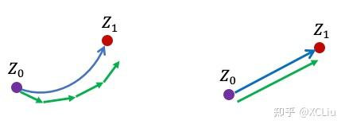
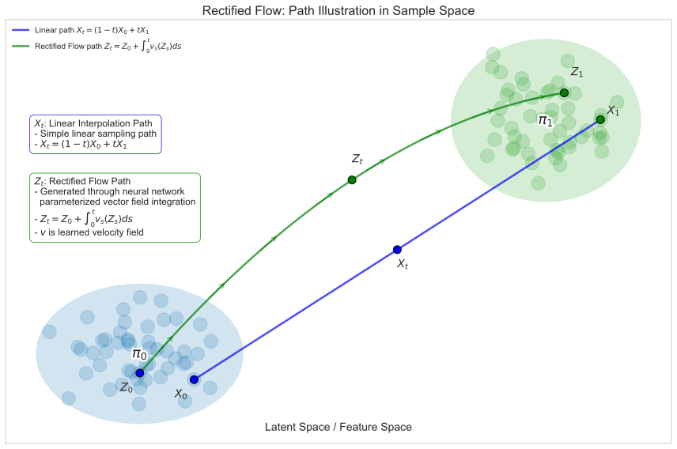
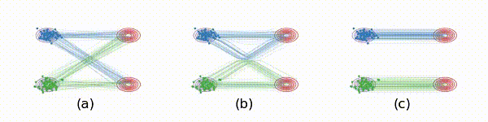
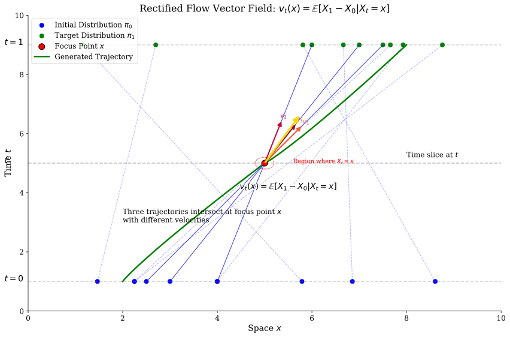
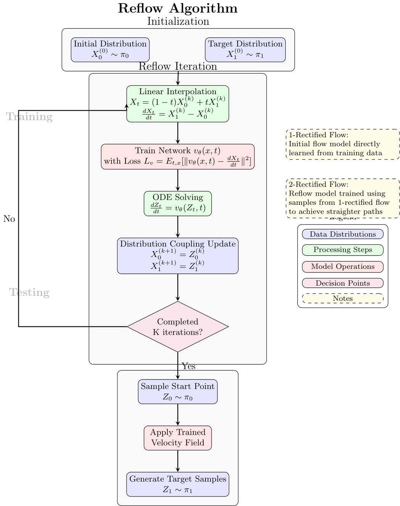
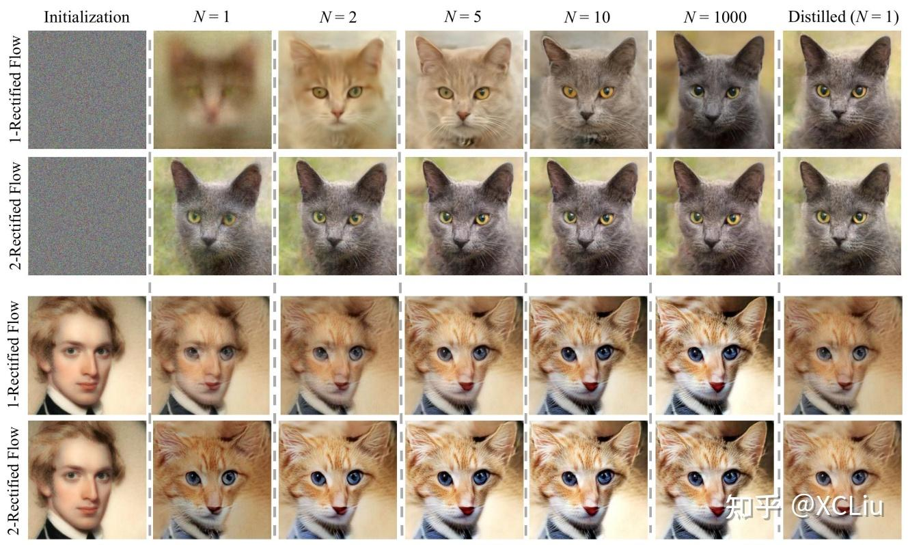

> Rectified Flow 通过将一个平滑连接噪声与数据的插值过程"因果化"（或称为校正）来学习常微分方程 (ODE) 生成模型。该过程自然倾向于产生更直的轨迹，从而使得快速的欧拉离散化成为可能，并且这一过程可以重复进行，以进一步提高轨迹的直线性。

## 目录

- 概述
- 问题：学习流生成模型
- Rectified Flow
- Reflow
- 整体流程

## 概述

对于生成类任务来说，本质上是从一个采样的分布 $p_{base}(z)$（文中为 $\pi_0$）经过一个生成模型（$G_{\theta}$）转换到一个新的分布 $p_{\theta}(x)$（文中为 $\pi_1$）的过程。

如果对于生成任务，$\pi_0$ 可以从一个已知的分布（例如高斯分布）进行采样，对于新的分布（$\pi_1$）我们不一定能够简单用数学描述，但可以从大量从 $\pi_1$ 中采样的样本进行模拟。

那么不论我们设计一个什么样的生成方法，它都需要要做到我们生成的分布 $p_G(x)$ 与数据的真实分布 $p_{data}(x)$ 要尽可能一致。

### 回顾 DDPM

传统 DDPM 有两个问题：

1. 原理非常复杂，用到了类似随机微分方程（SDE）这类的过程，对于我们来说理解原理是比较复杂的（一看头就大）。

2. 生成速度相对较慢，需要一步步生成从 $Z_0$（通常要 20 - 1000 步） 逼近 $Z_1$。

那么有没有原理更简单、生成速度更快（最好一步生成）的方法呢？Rectified Flow 就是这样一种方法。

Rectified Flow，一个"简简单单走直线"生成模型，是对这些挑战的一个回答：极度简单，一步生成。该方法有以下要点：

（1）无需一般扩散模型复杂的推导，代之以一个简单的"沿直线生成"的思想。算法理解上不需要变分法或随机微分方程等基础知识。Rectified Flow方法基于一个简单的常微分方程(ODE)，通过构造一个"尽量走直线"的连续运动系统来产生想要的数据分布。

（2）"尽量走直线"的目的是让模型实现快速生成。通过一个叫"reflow"的方法，可以实现梦想中的"一步生成"：只需一步计算就直接产生高质量的结果，而不需要调用计算量大的数值求解器来迭代式地模拟整个扩散过程。

（3）通常的扩散模型是把高斯白噪声转换成想要的数据(比如图片)。Rectified Flow 方法可以把任何一种数据或噪声(比如猫脸照片)转换成另外一种数据(比如人脸照片)。所以该方法不仅可以做生成模型，还可以应用于很多更广泛的迁移学习 (比如domain transfer）任务上。

## 问题定义：学习流生成模型

**问题定义**

无论是生成类问题（Generative Models）还是风格迁移类问题（Domain Transfer），都是一个分布到另一个分布的转化，因此可以看作是一个传输映射问题（Transport Mapping Problem）问题：

> 给定两个经验分布 $X_0 \sim \pi_0, X_1 \sim \pi_1$，目标是找到一个传输映射 $T: \mathbb{R}^d \to \mathbb{R}^d$，使得当 $Z_0 \sim \pi_0$ 时，$Z_1 := T(Z_0) \sim \pi_1$。这里 $(Z_0, Z_1)$ 构成了 $\pi_0$ 和 $\pi_1$ 的一个耦合。

生成建模可以被表述为寻找一种计算过程，将一个噪声分布（记作 $\pi_0$）转化为一个通过数据观察到的未知数据分布 $\pi_1$。在流模型中，这个过程由常微分方程 (ODE) 表示：

$$
\dot{Z}_t = \frac{dZ_t}{dt} = v_t^*(Z_t), \quad \forall t \in [0,1], \quad \text{starting from } Z_0 \sim \pi_0 \tag{1}

$$

积分形式就是：

$$
Z_t = Z_0 + \int_0^t v_s^*(Z_s)ds, \quad \forall t \in [0,1], \quad Z_0 = X_0

$$

其中 $\dot{Z}_t = \dfrac{dZ_t}{dt}$ 表示时间导数，而速度场 $v_t^*(x) = v^*(x,t)$ 是一个待学习的函数，其目的是确保从 $Z_0 \sim \pi_0$ 出发时，通过公式 $Z_1 = Z_0 + \int_0^1 v_t^*(Z_t)dt $ 积分到 $Z_1$ 能够遵循目标分布 $Z_1 \sim \pi_1$。在这种情况下，我们称随机过程 $Z=\{Z_t\}$ 提供了从 $\pi_0$ 到 $\pi_1$ 的（ODE）传输。

需要注意的是，通常会有**无限多种** ODE 传输从 $\pi_0$ 到 $\pi_1$。因此，明确我们应当偏好哪种类型的 ODE 非常关键。

一种选择是偏好那些在推理时**易于求解**的 ODE。实际上，ODE 的积分过程通常通过**数值方法**进行近似求解，这些方法通常构造 ODE 轨迹的**分段线性**近似。例如，一个常见的数值方法选择是欧拉方法（Eular method，当然还有 RK4 等方法）：

$$
\hat{Z}_{t+\epsilon} = \hat{Z}_t + \epsilon\, v_t^*(\hat{Z}_t), \quad \forall t \in \{0, \epsilon, 2\epsilon, \dots, 1\} \tag{2}

$$

其中 $ \epsilon > 0 $ 是步长。调整步长 $ \epsilon $ 会在精度和计算成本之间构成权衡：较小的 $ \epsilon $ 能提高精度，但需要更多的计算步骤。因此，我们应追求那些即便在较大步长下也能精确近似的 ODE。

***图1.** Lady Windermere's fan 图示了欧拉方法轨迹的误差累积情况：不同初始点的轨迹随着时间偏离真实解曲线。*

理想情况是当 ODE 轨迹完全为直线时，欧拉法可实现**零离散化误差**，而不受步长选择的影响。在这种情况下，经时间重参数化后，ODE 应满足：

$$
Z_t = t\,Z_1 + (1-t)\,Z_0, \quad \implies \quad \dot{Z}_t = Z_1 - Z_0

$$

这些 ODE 被称为**直线传输**，它们能够实现可在一步内模拟的**快速**生成模型。我们将所得的对 $ (Z_0,Z_1) $ 称为 $ \pi_0 $ 与 $ \pi_1 $ 的直线耦合。尽管在实际中可能无法达到完美直线性，但我们可以尽量使 ODE 轨迹直，从而最大化计算效率。

> **耦合（Coupling）的作用**
> 在概率论中，两个分布 $ \pi_0 $ 和 $ \pi_1 $ 的**耦合**是指它们的联合概率分布 $ \gamma(x_0, x_1) $，满足：
>
> $$
> \int \gamma(x_0, x_1) dx_1 = \pi_0(x_0), \quad \int \gamma(x_0, x_1) dx_0 = \pi_1(x_1)
>
> $$
>
> 即边缘分布分别为 $\pi_0$ 和 $\pi_1$。
>
> **在 Rectified Flow 中的意义**
>
> 1. **轨迹构造基础**
>    耦合 $(X_0, X_1) \sim \gamma$ 定义了噪声样本 $X_0 \sim \pi_0$ 与数据样本 $X_1 \sim \pi_1$ 的配对关系，进而通过插值生成中间轨迹：
>
>    $$
>    X_t = t X_1 + (1-t) X_0
>
>    $$
> 2. **影响ODE直线性**
>    不同的耦合会导致不同的插值轨迹形态：
>
>    - **独立耦合**：$X_0$ 与 $X_1$ 独立采样（$\gamma = \pi_0 \times \pi_1$），轨迹易交叉（图2a）
>    - **直线耦合**：存在双射 $X_1 = F(X_0) $，使得所有轨迹为直线（理想情况）
>
> **本文中涉及的耦合**
>
>
> | 耦合类型           | 数学形式                      | 轨迹特性           | 生成效率         |
> | -------------------- | ------------------------------- | -------------------- | ------------------ |
> | **独立耦合**       | $\gamma = \pi_0 \times \pi_1$ | 多交叉，曲率大     | 低（需多步采样） |
> | **Straight 耦合**  | $X_1 = X_0 + v(X_0)$          | 无交叉，完全直线   | 高（单步生成）   |
> | **Rectified 耦合** | 通过 Reflow 迭代优化          | 渐进直化，交叉减少 | 逐步提升         |

## Rectified Flow

### 符号定义

原始样本：

* $X_0$ ：初始分布 $\pi_0$ 中的样本（比如高斯噪声）
* $X_1$ ：目标分布 $\pi_1$ 中的样本（比如真实图像）
* $X_t = t X_1 + (1-t) X_0$：线性插值 $t$ 时刻的轨迹

Rectified Flow：

* $Z_0$ ：与 $X_0$ 具有相同分布的新起点（比如重新在高斯噪声中采样）
* $Z_1$ ：通过 Rectified Flow 网络预测速度并积分得到的新的对应于 $Z_0$ 的终点
* $Z_t = Z_0 + \int_0^t v_s^*(Z_s)ds$：ODE 过程积分 $t$ 时刻的轨迹

对于每一次迭代后的耦合对可以采用上标 $k$ 表示，例如： $Z_0^k$ 和 $Z_1^k$。

二者的区别：原始耦合是随机的他们的路径可能交叉，Rectified 耦合之间的样本路径更直。

为了构造一个从 $\pi_0$ 到 $\pi_1$ 的流，假设我们获得了一个任意耦合 $(X_0, X_1)$（例如，$\pi_0 \times \pi_1$ 的**独立耦合**，这是当我们可以获取 $\pi_0$ 和 $\pi_1$ 独立样本时常见的情况）。基本思路是将 $(X_0, X_1)$ 转换为由 ODE 模型生成的更优耦合。我们还可以选择性地重复这一过程，以进一步提升诸如直线性等目标属性。

### Rectified Flow 的构造方法

Rectified Flow 的构造方法如下：

* **构建插值：**

  首先，构建一个插值过程 $\{X_t\} = \{X_t: t \in [0,1]\}$，在 $X_0$ 与 $X_1$ 之间平滑过渡。虽然可以选择其它插值方式，但这里我们采用典型的直线插值：

  $$
  X_t = t\,X_1 + (1-t)\,X_0

  $$

  这种插值过程 $\{X_t\}$ 是通过 **"锚定-桥接"** 方式生成的：首先采样端点 $X_0$ 与 $X_1$，然后生成连接这两者的中间轨迹。
* **边际匹配：**

  通过上述构造，插值过程 $\{X_t\}$ 的端点 $X_0$ 和 $X_1$ 自然匹配目标分布 $\pi_0$ 与 $\pi_1$。但是，$\{X_t\}$ 并不是一个 **因果** 的 ODE 过程（因为实际预测时采样一个新的 $Z_0$ 我们不可能知道 $Z_1$ 并和 $X$ 一样直接差值得到）。那么我们自然想到的是如果可以预测 $t$ 时刻的速度 $v_t^*(Z_t)$，这样一个因果的 ODE 过程来实现：

  $$
  \frac{dZ_t}{dt}=v_t^*(Z_t)

  $$
* **速度场估计：**

  为了将插值过程转换为 ODE 流，我们需要使用神经网络学习预测一个速度场 $v_t^*(X_t)$ 。那么最直观的想法就是最小化刚才我们差值得到的样本速度与预测的速度的平方误差。为此，我们把 Loss 定义为如下优化问题：

  $$
  \mathcal{L}=\min_v \int_0^1 \mathbb{E}\Bigl[\|\dot{X}_t - v_t^*(X_t)\|^2\Bigr] dt.

  $$

  其中：

  $$
  \dot{X}_t = X_1 - X_0

  $$

  > **符号说明。** 一个随机过程 $X_t = X(t,\omega)$ 是关于时间 $t$ 及随机种子 $\omega$ 的可测函数（随机种子的分布记作 $\mathbb{P}$）。在这里，端点 $(X_0,X_1)$ 就构成了随机种子；而 $\dot{X}_t = \partial_t X(t,\omega)$ 是关于 $t$ 的偏导数，同样依赖于同一随机种子。通常我们在书写时会省略随机种子的符号。
  >

那我们整个 Rectified Flow 的训练方法就定义完了，看起来非常简单。但很明显我们会想到下面的两个问题：

🚀️ 问题1：通过 Loss 优化得到的最优解 $v_t^*(x)$ 应该是什么呢？

在后面的证明中，我们会经过推导得到这一优化问题的最优解为条件均值：

$$
v_t^*(x) = \mathbb{E}\bigl[\dot{X}_t \mid X_t = x\bigr].

$$

🚀️ 问题2：$X_t$ 和 $Z_t$ 的分布是一样的吗（即 $p(x_t) = p(z_t)$）？

从最优解看来，$v_t^*(x)$ 肯定是不会交叉的，且也不可能保证和原始样本一样是直线差值。

***图2.** 图中展示了从 $\pi_0$ 到 $\pi_1$ 的 Rectified Flow。蓝色和绿色轨迹表示不同模式的轨迹，便于可视化。*

* 图2(a) 展示了 $X_t$ 线性插值的轨迹（直线，且可能存在相交）
* 图2(b) 展示了通过 $v_t^*(x)$ 的速度场重构的 Rectified Flow 轨迹（不相交，也不一定为直线）
* 图2(c) 是我们希望实现的理想的一一对应的直线路径，那在这种情况下因为是直线我们可以 ”一步生成“。

看起来轨迹都不一样，那么 $X_t$ 和 $Z_t$ 的分布是一样的吗（即 $p(x_t) = p(z_t)$）？

图3：示意图 $v_t^*(x) = \mathbb{E}\bigl[X_1 - X_0 \mid X_t = x\bigr].$

**直观解释：**

- 在插值过程 $\{X_t\}$ 中，不同轨迹可能相交，因而在某一点 $X_t$ 处可能得到多个不同的 $\dot{X}_t$ 值（参见图2a）。
- 相比之下，在由 $\dot{Z}_t = v_t^*(Z_t)$ 定义的 ODE 中，每个点 $Z_t$ 的更新方向是唯一确定的，这避免了交叉后方向分叉的情况。
- 所以，在交叉点处，ODE 通过采用条件均值 $v_t^*(x)$ 来"去随机化"更新方向，从而将各插值轨迹重构为不交叉的路径（参见图2b）。
- 由于 ODE 轨迹 $\{Z_t\}$ 不能相交，它们必须在潜在的交叉点处弯曲，以"重连"原始插值路径并避免交叉。

## Reflow

尽管 Rectified Flow 倾向于生成更直的轨迹，但这些轨迹并不完全是直线。正如图2(b)所示，在插值轨迹的交叉点处，流仍可能发生转弯。那么，我们如何进一步提升流，使得轨迹更直，从而加速推理？

一个关键的见解是，Rectified Flow 生成的起止对 $ (Z_0, Z_1) $（也称为 **Rectified Coupling**）相比原始耦合 $ (X_0, X_1) $ 更优、更"直"。这是因为如果我们用直线插值重新连接 $ Z_0 $ 与 $ Z_1 $，那么得到的轨迹将交叉得更少。因此，通过基于重新插值耦合训练一个新的 Rectified Flow，我们能够进一步使轨迹直化，从而实现更快的采样推理。

> **Reflow 与捷径学习**：直观上，Reflow 类似于人类的捷径学习：一旦首次解决了某个问题，我们便学会了直接走捷径，从而在下一次能够更快地得到解答。

### Reflow 算法

Reflow 的核心思想是将一个流的输出作为下一个流的输入，通过迭代提高直线性。

形式上，我们递归应用 $ \texttt{Rectify}(\cdot) $ 操作，从 $ (Z_0^0, Z_1^0) = (X_0, X_1) $ 开始，得到一系列 Rectified Flow：

$$
\texttt{Reflow:} \quad \{Z_t^{k+1}\} = \texttt{Rectify}(\texttt{Interp}(Z_0^k, Z_1^k)),

$$

其中 $ \texttt{Interp}(Z_0^k, Z_1^k) $ 表示利用 $ (Z_0^k, Z_1^k) $ 构造的插值过程。我们将 $ \{Z_t^k\} $ 称为第 $ k $ 个 Rectified Flow，简称为 **$ k $-Rectified Flow**，它是由 $ (X_0, X_1) $ 诱导得到的。

完整的 Reflow 算法将在"整体流程"部分的算法 3 中详细描述。

### 流的直线性度量

这一 Reflow 过程被证明能使轨迹更直。为了量化流的直线性，我们定义以下度量：

$$
S(Z_t) = \mathbb{E}\left[\int_0^1 \left\|\frac{d Z_t}{dt} - (Z_1 - Z_0)\right\|^2 dt\right] \tag{12}

$$

当 $S(Z_t) = 0$ 时，流完全由直线组成。

研究表明：

$$
\mathbb{E}_{k \sim \mathrm{Unif}(\{1,\dots,K\})}\Bigl[S(\{Z_t^k\})\Bigr] = \mathcal{O}\Bigl(\frac{1}{K}\Bigr)

$$

这意味着在前 $ K $ 次迭代中，直线性度量的平均值以 $ \mathcal{O}(1/K) $ 的速率衰减。

需要注意的是，Reflow 可以从任一耦合 $ (X_0, X_1) $ 开始，因此它提供了一种普适的直化（加速）方法，同时保留边际分布不变。

### 一步采样

Reflow 的一个重要应用是实现"一步采样"。当流足够直时，我们可以使用一个大步长（$\epsilon = 1$）直接从 $Z_0$ 生成 $Z_1$：

$$
Z_1 \approx Z_0 + v_\theta(Z_0, 0) \tag{14}

$$

这大大加速了生成过程，可以接近图 2(c) 的理想结果，使得 Rectified Flow 在实际应用中更具吸引力。

## 整体流程

### Rectified Flow 与 Reflow 算法

基于上述理论，我们可以总结 Rectified Flow 的训练、采样和 Reflow 迭代算法：

**算法 1: Rectified Flow 训练**

1. **输入**：从 $\pi_0$ 和 $\pi_1$ 中采样的数据对 $(X_0, X_1)$
2. **对每个训练步骤**:
   - 随机采样时间点 $t \sim \text{Uniform}(0,1)$
   - 计算插值点 $X_t = t X_1 + (1-t) X_0$
   - 更新速度场网络 $v_\theta$ 以最小化损失 $\mathbb{E}[\|X_1 - X_0 - v_\theta(X_t, t)\|^2]$
3. **输出**：训练好的速度场网络 $v_\theta$

**算法 2: Rectified Flow 采样**

1. **输入**：训练好的速度场 $v_\theta$，采样点 $Z_0 \sim \pi_0$，步长 $\epsilon$
2. **初始化** $Z_0 \sim \pi_0$
3. **对 $t = 0, \epsilon, 2\epsilon, ..., 1-\epsilon$ 执行**:
   - 更新 $Z_{t+\epsilon} = Z_t + \epsilon \cdot v_\theta(Z_t, t)$
4. **输出**: 生成样本 $Z_1 \sim \pi_1$

**算法 3: Reflow 完整流程**

1. **初始化**: 设置 $k = 0$，初始耦合 $(Z_0^0, Z_1^0) = (X_0, X_1)$
2. **重复直到满足终止条件**:
   - **训练阶段**:
     - 使用算法 1 基于当前耦合 $(Z_0^k, Z_1^k)$ 训练速度场 $v_\theta^{k+1}$
   - **采样阶段**:
     - 使用算法 2 和训练好的速度场 $v_\theta^{k+1}$ 生成新的耦合 $(Z_0^{k+1}, Z_1^{k+1})$
   - **评估直线性**:
     - 计算新流的直线性度量 $S(Z_t^{k+1})$
     - 如果 $S(Z_t^{k+1})$ 小于阈值或迭代次数达到上限，则停止迭代
   - 更新 $k = k + 1$
3. **最终输出**:
   - 最优速度场 $v_\theta^k$（可用于一步采样 $Z_1 \approx Z_0 + v_\theta^k(Z_0, 0)$）

### 理论性质

在 Rectified Flow 中，我们学习到的 ODE 流 $\{Z_t\}$ 具有以下重要性质：

1. **边际保持**：对于任意 $t \in [0,1]$，如果 $Z_0 \sim \pi_0$，那么 $Z_t$ 的分布与 $X_t$ 的分布相同，特别是 $Z_1 \sim \pi_1$。
2. **轨迹直线化**：与原始插值轨迹 $\{X_t\}$ 相比，ODE 流 $\{Z_t\}$ 的轨迹更接近直线，这使得数值求解更高效。

这些性质使 Rectified Flow 成为一种有效的生成模型方法，特别是当我们需要快速生成样本时。

最终整体流程图如下：

**图7：** Rectified Flow 和 Reflow 的整体流程图。

## 实验效果

**图8：** 1-Rectified Flow 与 2-Rectified Flow 的生成效果对比。
