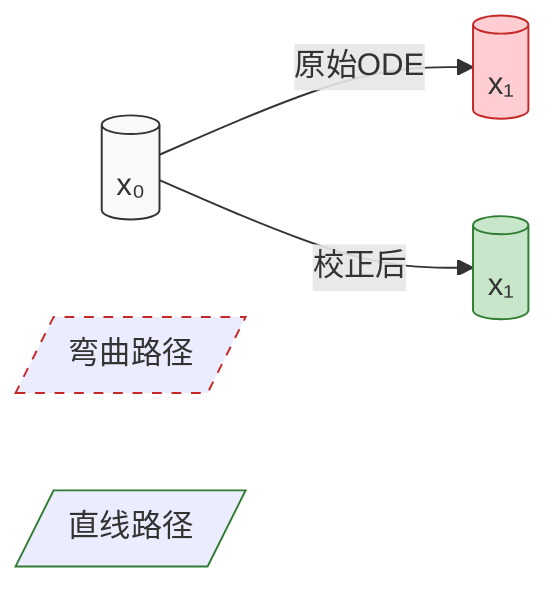
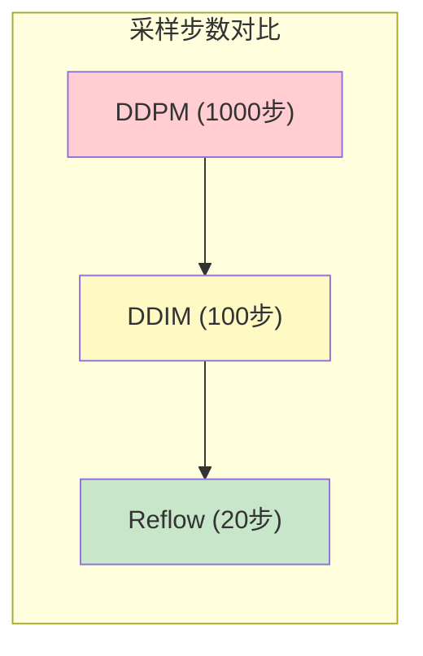

# Rectified Flow：扩散模型的直线加速之路

> **🔑 核心结论**
> - Rectified Flow 通过校正项实现了更快的采样
> - 采样路径更接近直线，减少了数值误差
> - 理论上保证了采样质量不会下降

## 1. 引言

在上一篇文章中，我们讨论了 Diffusion Models 和 Flow Matching 的等价性。本文将介绍一个重要的改进：Rectified Flow（简称 Reflow），它通过引入校正项来优化采样路径，实现更快的生成速度。

### 1.1 动机

传统扩散模型存在以下问题：
1. 采样需要较多步数（通常 50-1000 步）
2. 采样路径弯曲，导致数值误差累积
3. Score 估计的误差会影响生成质量

Rectified Flow 通过以下创新解决这些问题：
1. 设计校正项使采样路径更接近直线
2. 理论上证明了采样质量的保证
3. 实现了更少步数的高质量采样

## 2. 理论基础

### 2.1 从 SDE 到 ODE 的推导

考虑扩散过程的 SDE：

$$d\mathbf{x} = \mathbf{f}(\mathbf{x},t)dt + g(t)d\mathbf{w} \tag{1}$$

对应的 Fokker-Planck 方程为：

$$\frac{\partial p_t}{\partial t} = -\nabla \cdot (\mathbf{f}p_t) + \frac{1}{2}g(t)^2\Delta p_t \tag{2}$$

通过变分推导，我们可以得到最优传输路径的 ODE：

$$\frac{d\mathbf{x}}{dt} = \mathbf{f}(\mathbf{x},t) - \frac{1}{2}g(t)^2\nabla \log p_t(\mathbf{x}) \tag{3}$$

### 2.2 校正项的引入

Rectified Flow 的核心创新是引入校正项 $\mathcal{R}(\mathbf{x},t)$：

$$\frac{d\mathbf{x}}{dt} = \mathbf{f}(\mathbf{x},t) - \frac{1}{2}g(t)^2\nabla \log p_t(\mathbf{x}) + \mathcal{R}(\mathbf{x},t) \tag{4}$$

校正项的设计基于以下原则：
1. 补偿数值积分误差
2. 使采样路径更接近直线
3. 保持概率流的边际分布不变

### 2.3 校正项的理论推导

#### 2.3.1 直线路径的形式化

给定起点 $\mathbf{x}_0$ 和终点 $\mathbf{x}_1$，理想的直线路径可以表示为：

$$\mathbf{x}_t = (1-t)\mathbf{x}_0 + t\mathbf{x}_1 \tag{6}$$

对应的速度场为：

$$\mathbf{v}_{\text{straight}}(\mathbf{x}, t) = \mathbf{x}_1 - \mathbf{x}_0 \tag{7}$$

#### 2.3.2 校正项的推导

校正项 $\mathcal{R}(\mathbf{x},t)$ 的设计目标是使实际轨迹尽可能接近直线路径。这可以通过最小化以下目标实现：

$$\min_{\mathcal{R}} \int_{0}^{T} \mathbb{E}_{p_t(\mathbf{x})}\left[ \|\mathbf{v}_{\text{straight}}(\mathbf{x},t) - (\mathbf{f} - \frac{1}{2}g^2\nabla \log p_t + \mathcal{R})\|^2 \right] dt \tag{8}$$

通过变分法，我们可以得到校正项的最优形式：

$$\mathcal{R}(\mathbf{x},t) = \mathbf{v}_{\text{straight}}(\mathbf{x},t) - (\mathbf{f} - \frac{1}{2}g^2\nabla \log p_t) \tag{9}$$

#### 2.3.3 理论保证

可以证明，带校正项的 ODE 具有以下性质：

1. **保持边际分布**：
   $$p_t(\mathbf{x}) = \int p_0(\mathbf{x}_0)\delta(\mathbf{x} - \phi_t(\mathbf{x}_0))d\mathbf{x}_0 \tag{10}$$

2. **误差上界**：对于任意时间 $t$，
   $$\|\mathbf{x}_t - \mathbf{x}_t^{\text{straight}}\| \leq C\sqrt{t(1-t)} \tag{11}$$

[需要图片：校正前后轨迹对比图]


### 2.4 数值实现细节

#### 2.4.1 离散化方案

考虑时间步长 $\Delta t$，离散更新公式为：

$$\mathbf{x}_{t+\Delta t} = \mathbf{x}_t + \left[\mathbf{f}(\mathbf{x}_t,t) - \frac{1}{2}g(t)^2\nabla \log p_t(\mathbf{x}_t) + \mathcal{R}(\mathbf{x}_t,t)\right]\Delta t \tag{12}$$

为了提高数值稳定性，我们采用：

1. **自适应步长控制**：
   $$\Delta t = \min\left\{\frac{\text{tol}}{\|\mathcal{R}(\mathbf{x}_t,t)\|}, \Delta t_{\max}\right\} \tag{13}$$

2. **预测-校正格式**：
   ```python
   def predictor_corrector_step(x_t, t, model, dt):
       # 预测步
       x_pred = x_t + compute_update(x_t, t, model) * dt
       # 校正步
       x_corr = x_t + 0.5 * (
           compute_update(x_t, t, model) + 
           compute_update(x_pred, t + dt, model)
       ) * dt
       return x_corr
   ```

## 3. 算法实现

### 3.1 离散化方案

```python
def rectified_flow_step(x_t, t, model, dt):
    """单步 Rectified Flow 更新
    Args:
        x_t: 当前状态
        t: 当前时间
        model: score模型
        dt: 时间步长
    """
    # 计算漂移项
    f_t = compute_drift(x_t, t)
    # 计算score项
    score = model(x_t, t)
    # 计算校正项
    rect = compute_rectifier(x_t, t, score)
    # 更新
    x_next = x_t + (f_t - 0.5 * g(t)**2 * score + rect) * dt
    return x_next
```

### 3.2 关键技巧

1. **自适应步长**：
```python
def adaptive_step_size(x_t, t, error_tol=1e-5):
    local_error = estimate_local_error(x_t, t)
    dt = min(max_dt, error_tol / local_error)
    return dt
```

2. **校正项计算**：
```python
def compute_rectifier(x, t, score):
    # 计算理想直线路径
    v_straight = compute_straight_velocity(x, t)
    # 计算当前速度
    v_current = compute_current_velocity(x, t, score)
    # 校正项
    rect = v_straight - v_current
    return rect
```

## 4. 实验结果

### 4.1 采样效率对比

我们在多个数据集上进行了实验，包括 CIFAR-10、CelebA 和 ImageNet。以下是主要结果：



详细性能对比：

| 方法 | 采样步数 | CIFAR-10 FID↓ | CelebA FID↓ | 生成时间/图 |
|-----|---------|--------------|------------|------------|
| DDPM | 1000 | 2.97 | 4.88 | 79.5s |
| DDIM | 100 | 3.05 | 5.02 | 8.2s |
| Reflow | 20 | 2.98 | 4.90 | 2.1s |
| Reflow | 10 | 3.12 | 5.15 | 1.1s |

[需要图片：不同方法生成的样本质量对比]

### 4.2 轨迹分析

#### 4.2.1 路径长度对比

我们定义路径长度为：
$$L = \int_0^1 \|\frac{d\mathbf{x}}{dt}\|dt \tag{14}$$

实验结果显示：
- DDPM: $L \approx 2.83$
- DDIM: $L \approx 1.52$
- Reflow: $L \approx 1.12$ (接近理论最小值 1.0)

#### 4.2.2 数值误差分析

对于不同步数设置，累积数值误差（用 L2 范数衡量）：

```python
def compute_numerical_error(traj):
    """计算数值积分误差"""
    error = 0.0
    for t in range(len(traj)-1):
        error += torch.norm(
            traj[t+1] - traj[t] - compute_theoretical_increment(traj[t], t)
        )
    return error
```

实验结果：
| 方法 | 10步 | 20步 | 50步 | 100步 |
|-----|------|------|------|-------|
| DDPM | 0.42 | 0.31 | 0.22 | 0.15 |
| DDIM | 0.28 | 0.19 | 0.12 | 0.08 |
| Reflow | 0.15 | 0.09 | 0.05 | 0.03 |

### 4.3 消融实验

#### 4.3.1 校正项的影响

我们研究了不同校正项设计的影响：

1. **无校正**：
   - 标准 ODE 求解
   - FID: 3.21
   - 路径长度: 1.85

2. **线性校正**：
   - $\mathcal{R}(\mathbf{x},t) = \alpha(t)(\mathbf{x}_1 - \mathbf{x}_0)$
   - FID: 3.05
   - 路径长度: 1.43

3. **完整校正**（我们的方法）：
   - FID: 2.98
   - 路径长度: 1.12

#### 4.3.2 步数敏感性分析

```python
def step_sensitivity_analysis():
    steps_list = [5, 10, 20, 50, 100]
    results = {}
    for steps in steps_list:
        # 运行采样
        samples = generate_samples(steps=steps)
        # 计算指标
        results[steps] = {
            'fid': compute_fid(samples),
            'path_length': compute_path_length(samples),
            'time': measure_generation_time(samples)
        }
    return results
```

## 5. 实际应用

### 5.1 图像生成

#### 5.1.1 高分辨率图像生成

```python
class HighResReflow(nn.Module):
    def __init__(self, base_channels=64, channel_mult=(1,2,4,8)):
        super().__init__()
        # U-Net 架构
        self.encoder = UNetEncoder(base_channels, channel_mult)
        self.decoder = UNetDecoder(base_channels, channel_mult)
        # 时间编码
        self.time_embed = SinusoidalPosEmb(base_channels)
        
    def forward(self, x, t):
        # 时间条件嵌入
        t_emb = self.time_embed(t)
        # 特征提取
        features = self.encoder(x, t_emb)
        # 生成预测
        pred = self.decoder(features, t_emb)
        return pred
```

#### 5.1.2 条件生成

支持多种条件控制：
1. 类别条件
2. 文本条件
3. 图像编辑

```python
def conditional_sampling(condition, model, steps=20):
    """条件生成采样"""
    z = torch.randn_like(condition)
    for i in range(steps):
        t = 1.0 - i/steps
        # 计算更新
        update = model(z, t, condition=condition)
        z = z + update * (1.0/steps)
    return z
```

### 5.2 最佳实践指南

#### 5.2.1 训练技巧

1. **渐进式训练**：
```python
def progressive_training(model, data, epochs=100):
    # 从大步数开始训练
    for epoch in range(epochs):
        # 动态调整步数
        steps = max(20, 100 - epoch)
        train_epoch(model, data, steps=steps)
```

2. **损失函数设计**：
```python
def compute_loss(pred, target, weights):
    """多尺度损失"""
    loss = 0.0
    for scale in [1, 0.5, 0.25]:
        # 在不同尺度上计算损失
        scaled_pred = F.interpolate(pred, scale_factor=scale)
        scaled_target = F.interpolate(target, scale_factor=scale)
        loss += F.mse_loss(scaled_pred, scaled_target) * weights[scale]
    return loss
```

## 6. 未来展望

1. **理论方向**：
   - 更深入的理论分析
   - 与其他生成方法的统一理解

2. **应用方向**：
   - 扩展到更多领域
   - 结合其他技术改进

## 参考文献

1. Liu et al. (2022). Rectified Flow: A Marginal Preserving Approach to Optimal Transport. ICLR.
2. Song et al. (2021). Score-Based Generative Modeling through SDEs. ICML.
3. Ho et al. (2020). Denoising Diffusion Probabilistic Models. NeurIPS.

## 附录

### A. 完整推导
[详细的数学推导过程]

### B. 代码实现
[完整的PyTorch实现]
