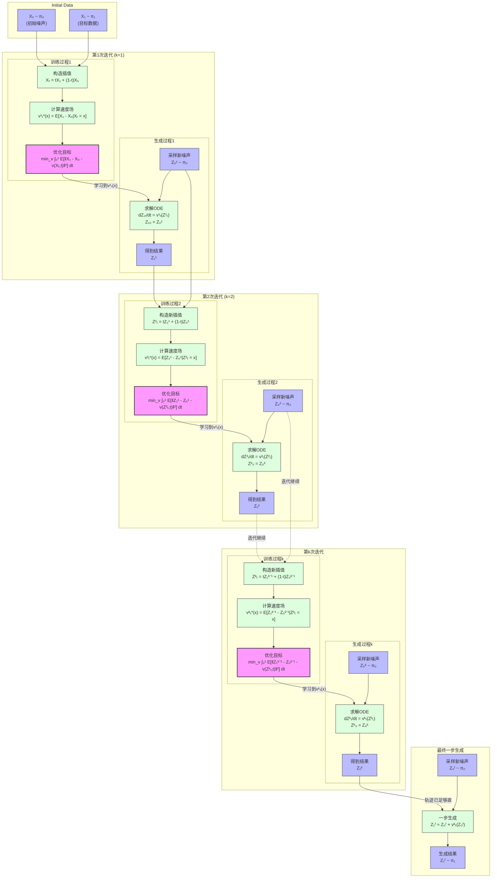

```mermaid
flowchart TD
    %% Initial setup
    subgraph "Initial Data"
        X0["X₀ ~ π₀\n(初始噪声)"]
        X1["X₁ ~ π₁\n(目标数据)"]
    end

    %% First iteration
    subgraph "第1次迭代 (k=1)"
        %% Training process
        subgraph "训练过程1"
            T1["构造插值\nXₜ = tX₁ + (1-t)X₀"]
            L1["计算速度场\nv¹ₜ*(x) = E[X₁ - X₀|Xₜ = x]"]
            O1["优化目标\nmin_v ∫₀¹ E[‖X₁ - X₀ - v(Xₜ,t)‖²] dt"]
        end

        %% Generation process
        subgraph "生成过程1"
            G1["采样新噪声\nZ₀¹ ~ π₀"]
            ODE1["求解ODE\ndZ₁ₜ/dt = v¹ₜ(Z¹ₜ)\nZ₁₀ = Z₀¹"]
            Z11["得到结果\nZ₁¹"]
        end
    end

    %% Second iteration
    subgraph "第2次迭代 (k=2)"
        %% Training process
        subgraph "训练过程2"
            T2["构造新插值\nZ²ₜ = tZ₁¹ + (1-t)Z₀¹"]
            L2["计算速度场\nv²ₜ*(x) = E[Z₁¹ - Z₀¹|Z²ₜ = x]"]
            O2["优化目标\nmin_v ∫₀¹ E[‖Z₁¹ - Z₀¹ - v(Z²ₜ,t)‖²] dt"]
        end

        %% Generation process
        subgraph "生成过程2"
            G2["采样新噪声\nZ₀² ~ π₀"]
            ODE2["求解ODE\ndZ²ₜ/dt = v²ₜ(Z²ₜ)\nZ²₀ = Z₀²"]
            Z12["得到结果\nZ₁²"]
        end
    end

    %% k-th iteration
    subgraph "第k次迭代"
        %% Training process
        subgraph "训练过程k"
            Tk["构造新插值\nZᵏₜ = tZ₁ᵏ⁻¹ + (1-t)Z₀ᵏ⁻¹"]
            Lk["计算速度场\nvᵏₜ*(x) = E[Z₁ᵏ⁻¹ - Z₀ᵏ⁻¹|Zᵏₜ = x]"]
            Ok["优化目标\nmin_v ∫₀¹ E[‖Z₁ᵏ⁻¹ - Z₀ᵏ⁻¹ - v(Zᵏₜ,t)‖²] dt"]
        end

        %% Generation process
        subgraph "生成过程k"
            Gk["采样新噪声\nZ₀ᵏ ~ π₀"]
            ODEk["求解ODE\ndZᵏₜ/dt = vᵏₜ(Zᵏₜ)\nZᵏ₀ = Z₀ᵏ"]
            Z1k["得到结果\nZ₁ᵏ"]
        end
    end

    %% Final one-step generation
    subgraph "最终一步生成"
        GF["采样新噪声\nZ₀ᶠ ~ π₀"]
        OneStep["一步生成\nZ₁ᶠ ≈ Z₀ᶠ + vᵏₜ(Z₀ᶠ)"]
        Result["生成结果\nZ₁ᶠ ~ π₁"]
    end

    %% Connections
    X0 & X1 --> T1
    T1 --> L1 --> O1
    O1 --> |"学习到v¹ₜ(x)"| ODE1
    G1 --> ODE1 --> Z11
    
    Z11 & G1 --> T2
    T2 --> L2 --> O2
    O2 --> |"学习到v²ₜ(x)"| ODE2
    G2 --> ODE2 --> Z12
    
    Z12 & G2 -.-> |"迭代继续"| Tk
    Tk --> Lk --> Ok
    Ok --> |"学习到vᵏₜ(x)"| ODEk
    Gk --> ODEk --> Z1k
    
    Z1k --> |"轨迹已足够直"| OneStep
    GF --> OneStep --> Result

    %% Style
    classDef model fill:#f9f,stroke:#333,stroke-width:2px
    classDef data fill:#bbf,stroke:#333,stroke-width:1px
    classDef process fill:#dfd,stroke:#333,stroke-width:1px
    
    class O1,O2,Ok model
    class X0,X1,G1,G2,Gk,GF,Z11,Z12,Z1k,Result data
    class T1,T2,Tk,L1,L2,Lk,ODE1,ODE2,ODEk,OneStep process
```